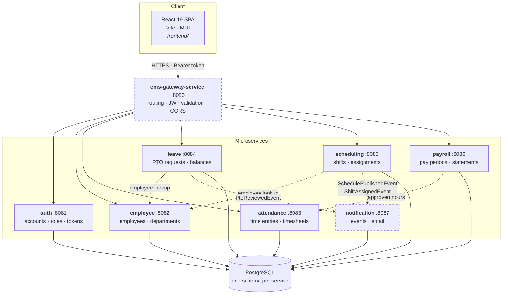
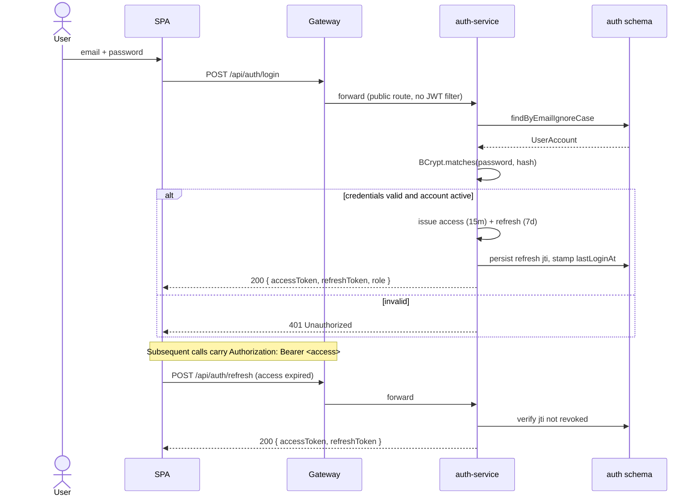
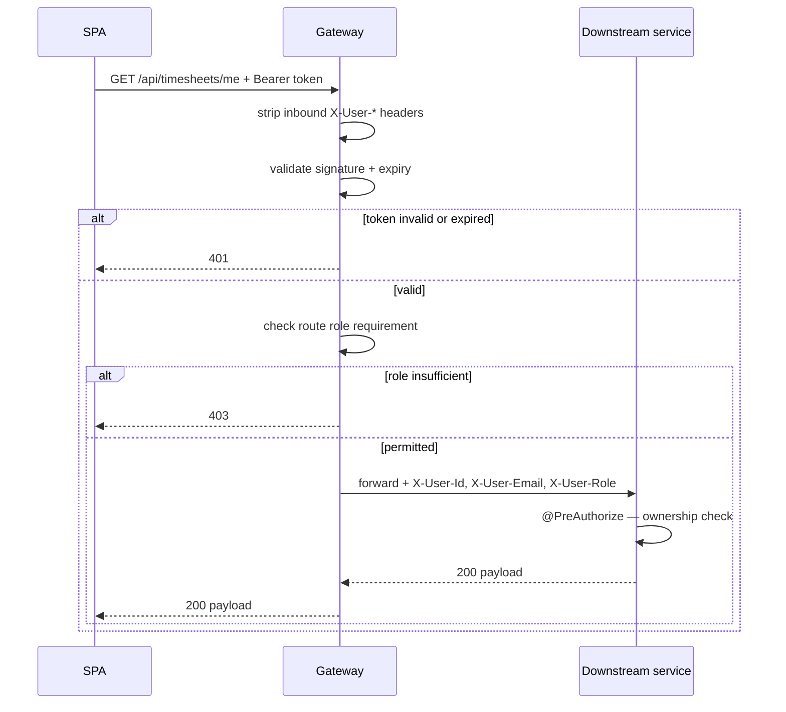
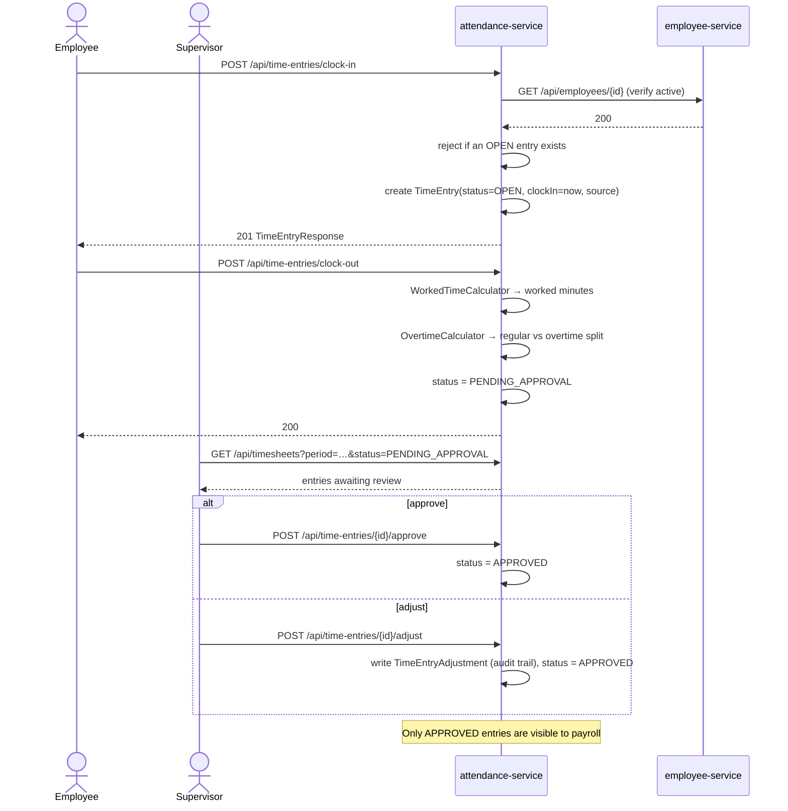
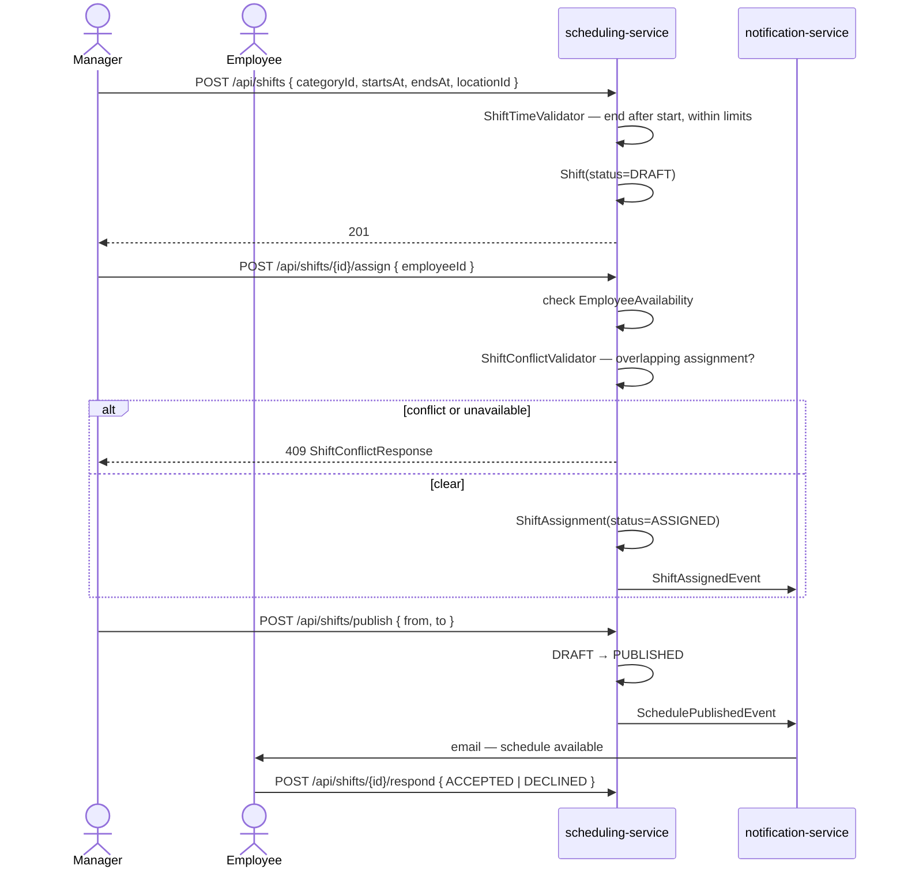
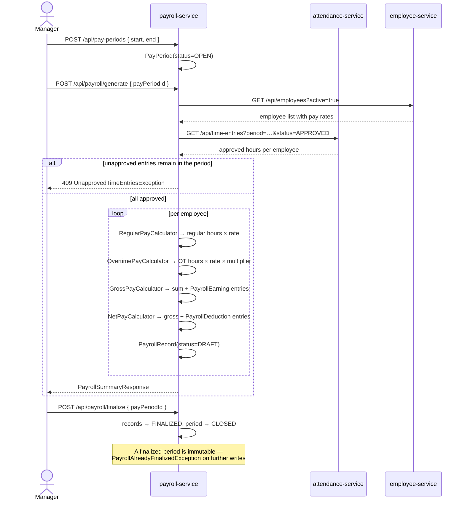
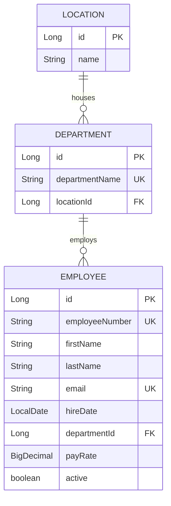
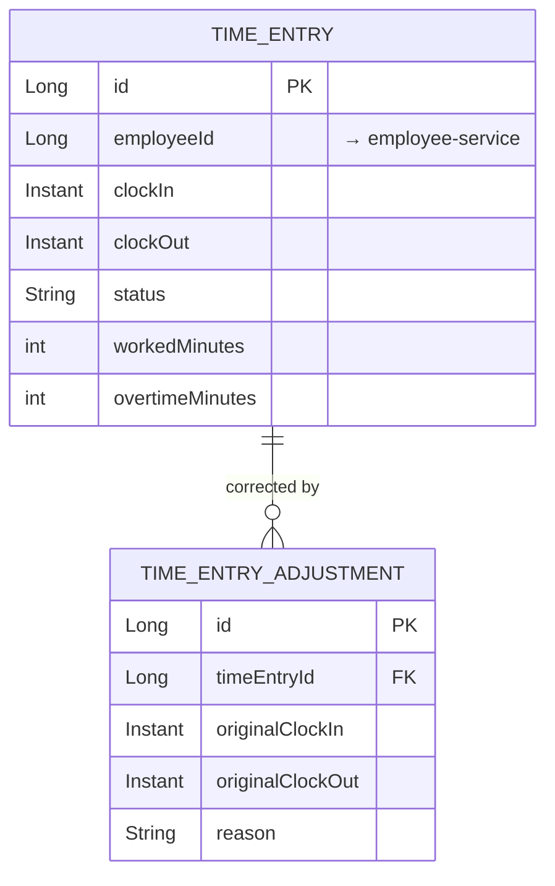
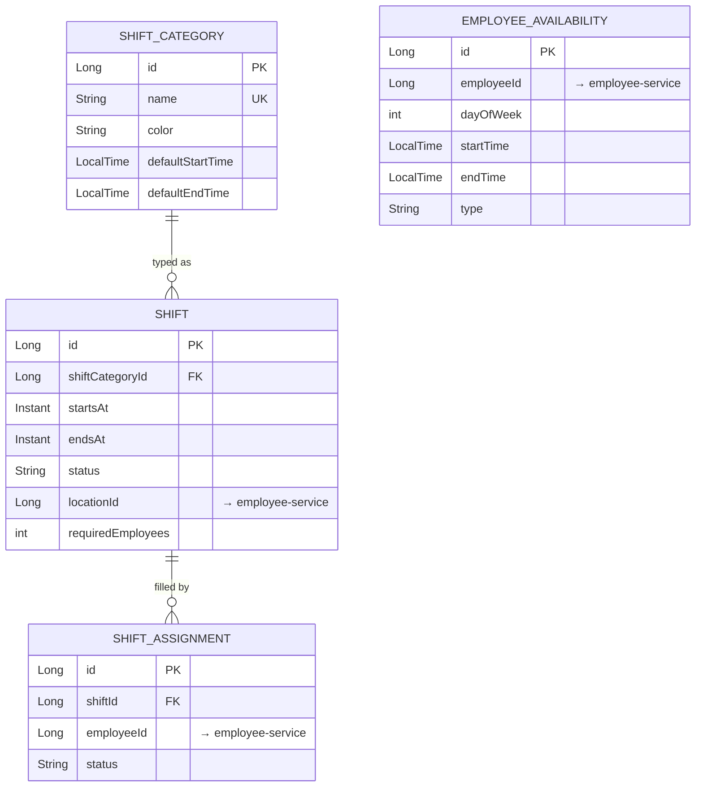
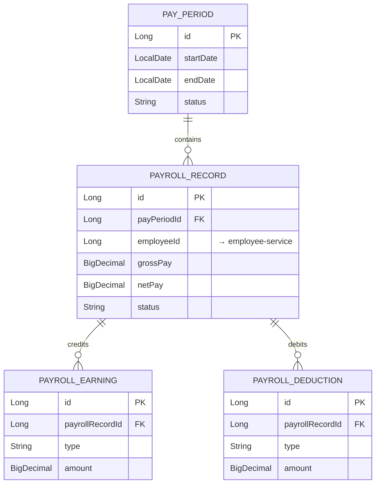

# EMS — Employee Management System

## Backend Architecture & System Documentation

> **Read this first.** This document is a **blueprint with a status tracker**, not a
> description of running software. The backend is currently a package skeleton: the
> directory structure and class names for seven microservices exist, but almost all of
> the classes are empty bodies, and **no HTTP endpoint is implemented anywhere in
> `ems-services`**. Sections marked **Target** describe the intended design to build
> toward. Sections marked **Current** describe what is on disk today. Where the two
> differ, the status tables in [§2](#2-status-at-a-glance) are the authority.

|                        |                                     |
| ---------------------- | ----------------------------------- |
| **Repository**         | `ems-system`                        |
| **Backend root**       | `ems-services/`                     |
| **Language / runtime** | Java 17                             |
| **Framework**          | Spring Boot 4.1.1                   |
| **Intended database**  | PostgreSQL                          |
| **Frontend**           | React 19 + Vite + MUI (`frontend/`) |
| **Document date**      | 2026-09-17                          |

---

## Table of contents

1. [Overview](#1-overview)
2. [Status at a glance](#2-status-at-a-glance)
3. [Architecture](#3-architecture)
4. [Repository & package hierarchy](#4-repository--package-hierarchy)
5. [API gateway](#5-api-gateway)
6. [Security model](#6-security-model)
7. [System workflows](#7-system-workflows)
8. [Data model](#8-data-model)
9. [Unplaced domains: `organization` and `reporting`](#9-unplaced-domains-organization-and-reporting)
10. [Architecture recommendations](#10-architecture-recommendations)
11. [Local development setup](#11-local-development-setup)
12. [Roadmap](#12-roadmap)
13. [Frontend consumers](#13-frontend-consumers)

---

## 1. Overview

EMS is an employee management system for an hourly/shift-based workforce. It covers six
business capabilities:

| Capability            | What it does                                                                                  |
| --------------------- | --------------------------------------------------------------------------------------------- |
| **Identity & access** | Accounts, passwords, roles, login, token issuance                                             |
| **Workforce**         | Employee master data, departments, locations                                                  |
| **Time & attendance** | Clock in/out, time entries, timesheets, supervisor approval, overtime                         |
| **Leave (PTO)**       | Leave requests, balances, accrual, approval workflow, ledger                                  |
| **Scheduling**        | Shift categories, shift creation and publishing, assignment, availability, conflict detection |
| **Payroll**           | Pay periods, payroll generation from approved hours, earnings, deductions, pay statements     |

### How the codebase got here

The project began as a single Spring Boot monolith at `ems-backend/`
(`com.emssystem.ems`), organized into ten domain packages. In the most recent commit the
monolith's package tree was **copied and split** into eight independent Maven projects
under `ems-services/`, one per intended microservice plus a gateway.

That split moved the _taxonomy_ — folder names, class names, layering — but not much
else. The monolith it was split from was itself mostly empty scaffolding (13 of its 227
Java files contain real code), so there was little working logic to carry across. The
result is a well-organized, largely unimplemented backend.

This document treats that structure as a design artifact worth taking seriously — the
domain decomposition and package conventions are sound and consistent — and fills in the
architecture, contracts, and build order needed to turn it into a working system.

> This document supersedes `ems-services/ems-auth-service/API-ENDPOINTS.md`, which
> describes three endpoints that no code implements.

---

## 2. Status at a glance

**Legend:** ✅ implemented · 🟡 partial · ⬜ scaffold (files exist, bodies empty) · ❌ not started

### What is runnable today

**Nothing.** No service can serve a request:

- Seven of the eight modules declare only `spring-boot-starter` and
  `spring-boot-starter-test`. They have **no web server, no JPA, and no database driver**
  on the classpath — so they start as non-web applications and exit immediately.
- The eighth (`ems-auth-service`) has the right dependencies but **does not currently
  compile**, and has no datasource configured.
- Every service's entire configuration is one line, `spring.application.name=…`. No
  ports, no datasource, no JWT settings exist anywhere in the repository.
- `ems-services/docker-compose.yml` contains one word — `services:` — so there is no
  database, broker, or container to run against.
- There is **no parent aggregator `pom.xml`** at `ems-services/`, so the backend cannot
  be built with a single command.

### Per-service status

| Service                    | Files | Substantive | Lines | Endpoints | Status                                                                                                                        |
| -------------------------- | ----: | ----------: | ----: | --------: | ----------------------------------------------------------------------------------------------------------------------------- |
| `ems-auth-service`         |    34 |          21 |   857 |         0 | 🟡 Account/role model, `UserDetails` layer and BCrypt exist. Login, JWT, and the security filter chain do not.                |
| `ems-scheduling-service`   |    54 |          10 |   632 |         0 | ⬜ Two entities (`Shift`, `ShiftCategory`) and two enums have content; all controllers, services, and repositories are empty. |
| `ems-employee-service`     |    25 |           8 |   483 |         0 | ⬜ `Employee` entity has fields; no repository file exists; service and controller empty.                                     |
| `ems-attendance-service`   |    38 |           6 |   428 |         0 | ⬜ Only shared config has content. Every attendance class is empty.                                                           |
| `ems-payroll-service`      |    38 |           1 |   162 |         0 | ⬜ Complete package skeleton, zero implementation.                                                                            |
| `ems-notification-service` |    11 |           1 |    53 |         0 | ⬜ Event and listener class names exist; nothing is wired.                                                                    |
| `ems-gateway-service`      |     1 |           1 |    13 |         0 | ❌ Bare Spring Initializr output. No Spring Cloud Gateway dependency, no routes, no filters.                                  |
| `ems-leave-service`        |     1 |           1 |    13 |         0 | ❌ Bare Initializr output. The monolith's `pto` domain (28 files) was never migrated.                                         |

_"Substantive" counts files with more than two lines of code excluding package,
imports, comments, and closing braces — i.e. files that are not empty class bodies._

### Cross-cutting status

| Concern                                             | Status                                                           |
| --------------------------------------------------- | ---------------------------------------------------------------- |
| Service discovery (Eureka/Consul)                   | ❌ Absent — and [not recommended](#101-service-discovery)        |
| Config server                                       | ❌ Absent                                                        |
| API gateway routing                                 | ❌ Absent                                                        |
| Inter-service communication (Feign / REST / broker) | ❌ Absent — zero matches repo-wide                               |
| Database provisioning                               | ❌ Absent — no datasource configured in any module               |
| Schema migrations (Flyway/Liquibase)                | ❌ Absent — no `.sql` files in the repository                    |
| Shared library module                               | ❌ Absent — config classes are duplicated across five modules    |
| Containerization                                    | ❌ No Dockerfiles; `docker-compose.yml` is empty                 |
| CI/CD                                               | ❌ No `.github/`, no pipeline of any kind                        |
| Tests                                               | ❌ 20 test files repo-wide, 19 of them empty or `contextLoads()` |

---

## 3. Architecture

**Target.** A standard edge-gateway topology: a single-page application talks to one
public entry point, which authenticates the request and routes it to the service that
owns the data.



Solid arrows are request paths; dashed arrows are inter-service calls and events.
Dashed borders mark modules with no implementation at all.

### Bounded contexts

Each service owns its data exclusively. No service reads another service's tables.

| Service                    | Owns                          | Key concepts                                                        |
| -------------------------- | ----------------------------- | ------------------------------------------------------------------- |
| `ems-auth-service`         | Credentials and authorization | `UserAccount`, `AccountRole`, JWT issuance                          |
| `ems-employee-service`     | Workforce master data         | `Employee`, and (recommended) `Department`, `Location`              |
| `ems-attendance-service`   | Recorded time                 | `TimeEntry`, `TimeEntryAdjustment`, timesheets, overtime            |
| `ems-leave-service`        | Leave entitlement and usage   | `PtoRequest`, `PtoBalance`, `PtoLedgerEntry`, `PtoType`             |
| `ems-scheduling-service`   | Planned time                  | `Shift`, `ShiftCategory`, `ShiftAssignment`, `EmployeeAvailability` |
| `ems-payroll-service`      | Compensation                  | `PayPeriod`, `PayrollRecord`, `PayrollEarning`, `PayrollDeduction`  |
| `ems-notification-service` | Outbound messaging            | `Notification`, domain event listeners                              |

### The boundary rule

> **A service never holds a reference to another service's entity type. Cross-service
> references are scalar IDs.**

Write `private Long employeeId;`, never `private Employee employee;`. An entity reference
across a service boundary implies a shared database and a compile-time dependency — it
defeats the split entirely.

This rule is stated plainly because the current code violates it in the places where it
was copied straight from the monolith: `ems-scheduling-service`'s `Shift` declares
`Employee[] required_employees` and imports `com.emssystem.ems.employee.entity.Employee`;
`ems-employee-service`'s `Employee` declares a `Department` field. Those types live in
other modules and are not on the importing module's classpath.

There is one deliberate exception: `Employee` is identified by a stable `employeeId` that
every other service stores. The employee service is the source of truth for whether that
ID is valid.

### Identity across services

Two identifiers coexist and should not be conflated:

- **`UserAccount.id`** (UUID) — a login identity, owned by the auth service.
- **`Employee.id`** (Long) — a person in the workforce, owned by the employee service.

Not every account is an employee (a system admin may not be), and the mapping between
them belongs in the employee service as a nullable `userAccountId` column.

---

## 4. Repository & package hierarchy

### Repository layout

```
ems-system/
├── ems-services/              ← the backend (this document)
│   ├── docker-compose.yml     ← currently empty
│   ├── ems-gateway-service/
│   ├── ems-auth-service/
│   ├── ems-employee-service/
│   ├── ems-attendance-service/
│   ├── ems-leave-service/
│   ├── ems-scheduling-service/
│   ├── ems-payroll-service/
│   └── ems-notification-service/
├── ems-backend/               ← legacy monolith, superseded
└── frontend/                  ← React SPA
```

Each service is an independent Maven project with its own `mvnw` wrapper (Maven 3.9.16)
and `spring-boot-starter-parent:4.1.1` as its parent. See
[§10.4](#104-add-a-parent-pom-and-a-shared-library) for why a parent pom should be added.

### Package convention

Every service follows the same layering, rooted at
`com.emssystem.ems<name>service`. This convention is the most valuable thing the
monolith split produced — it is applied consistently across all seven services and should
be preserved.

```
com.emssystem.ems<name>service
├── Ems<Name>ServiceApplication.java
├── <domain>/                        ← e.g. attendance, payroll, scheduling
│   ├── controller/                  ← @RestController; HTTP only, no business logic
│   ├── dto/
│   │   ├── request/                 ← inbound; bean-validation annotated
│   │   └── response/                ← outbound; never expose entities directly
│   ├── entity/                      ← @Entity; owns persistence mapping
│   ├── enums/                       ← domain enumerations
│   ├── exception/                   ← domain-specific, extend RuntimeException
│   ├── mapper/                      ← entity ↔ DTO conversion
│   ├── repository/                  ← Spring Data interfaces
│   ├── service/                     ← business rules and transactions
│   ├── calculation/                 ← pure functions (attendance, payroll)
│   └── validation/                  ← cross-field rules (scheduling, leave)
└── shared/
    ├── config/                      ← ClockConfig, JacksonConfig, JpaAuditingConfig, OpenApiConfig
    ├── entity/AuditableEntity       ← @MappedSuperclass: created/updated audit columns
    ├── exception/                   ← BusinessRuleException, ErrorCode, GlobalExceptionHandler
    ├── response/                    ← ApiErrorResponse, PageResponse
    ├── utils/DateTimeUtils
    └── validation/ValidationError
```

**Where to add a new endpoint.** Request DTO in `dto/request/`, response DTO in
`dto/response/`, method on the service in `service/`, thin delegating method on the
controller in `controller/`. Business rules belong in the service, never the controller.

### Conventions

| Concern           | Convention                                                                                                                          |
| ----------------- | ----------------------------------------------------------------------------------------------------------------------------------- |
| Module naming     | `ems-<domain>-service`                                                                                                              |
| Package naming    | `com.emssystem.ems<domain>service` (no separators)                                                                                  |
| Time handling     | `java.time` only. A `Clock` bean (`ClockConfig`) is injected so time is testable; never call `Instant.now()` directly in a service. |
| Instants vs dates | Store points in time as `Instant` (UTC); store calendar dates as `LocalDate`; store times-of-day as `LocalTime`.                    |
| JSON              | ISO-8601 dates, unknown properties ignored, nulls omitted (`JacksonConfig`)                                                         |
| Auditing          | Entities extend `AuditableEntity` for created/updated stamps                                                                        |
| Errors            | Domain exceptions extend `RuntimeException` and are translated to HTTP status by `GlobalExceptionHandler`                           |
| Validation        | Bean Validation on request DTOs; requires `spring-boot-starter-validation`                                                          |

---

## 5. API gateway

**Target — not yet built.** `ems-gateway-service` currently contains one class: an empty
`@SpringBootApplication`. It has no Spring Cloud Gateway dependency, no routes, no
filters, and no CORS configuration. This section is the specification to build it from.

### Responsibilities

The gateway is the single public entry point. It should do exactly four things:

1. **Route** `/api/**` to the owning service.
2. **Authenticate** — validate the JWT signature and expiry once, at the edge.
3. **Propagate identity** — inject trusted headers so downstream services don't re-parse tokens.
4. **Handle CORS** — one place, not seven.

It must **not** contain business logic, aggregate responses, or touch a database.

### Port map

| Service                    | Port |
| -------------------------- | ---: |
| `ems-gateway-service`      | 8080 |
| `ems-auth-service`         | 8081 |
| `ems-employee-service`     | 8082 |
| `ems-attendance-service`   | 8083 |
| `ems-leave-service`        | 8084 |
| `ems-scheduling-service`   | 8085 |
| `ems-payroll-service`      | 8086 |
| `ems-notification-service` | 8087 |

No service currently declares `server.port`, so all eight would default to 8080 and
collide. Assigning these is a prerequisite for running more than one service.

### Route table

| Path predicate                                                       | Target                     | Auth               |
| -------------------------------------------------------------------- | -------------------------- | ------------------ |
| `/api/auth/login`, `/api/auth/refresh`                               | `ems-auth-service`         | Public             |
| `/api/auth/**`                                                       | `ems-auth-service`         | Authenticated      |
| `/api/users/**`                                                      | `ems-auth-service`         | `ADMIN`            |
| `/api/employees/**`, `/api/departments/**`                           | `ems-employee-service`     | Authenticated      |
| `/api/time-entries/**`, `/api/timesheets/**`                         | `ems-attendance-service`   | Authenticated      |
| `/api/pto/**`                                                        | `ems-leave-service`        | Authenticated      |
| `/api/shifts/**`, `/api/shift-categories/**`, `/api/availability/**` | `ems-scheduling-service`   | Authenticated      |
| `/api/payroll/**`, `/api/pay-periods/**`                             | `ems-payroll-service`      | `MANAGER`, `ADMIN` |
| `/api/notifications/**`                                              | `ems-notification-service` | Authenticated      |

`ems-notification-service` is primarily event-driven; it is routed only so users can read
their own notification history.

### Configuration sketch

```yaml
server:
  port: 8080

spring:
  application:
    name: ems-gateway-service
  cloud:
    gateway:
      routes:
        - id: auth-service
          uri: http://localhost:8081 # http://ems-auth-service:8081 under Docker
          predicates:
            - Path=/api/auth/**,/api/users/**
        - id: employee-service
          uri: http://localhost:8082
          predicates:
            - Path=/api/employees/**,/api/departments/**
        # …one route per service
      globalcors:
        cors-configurations:
          "[/**]":
            allowedOrigins: "http://localhost:5173" # Vite dev server
            allowedMethods: [GET, POST, PUT, PATCH, DELETE, OPTIONS]
            allowedHeaders: "*"
            allowCredentials: true
```

### JWT filter and the identity header contract

A single `GlobalFilter` validates the token and converts it into headers that downstream
services trust:

| Header         | Content                                         |
| -------------- | ----------------------------------------------- |
| `X-User-Id`    | `UserAccount.id` (UUID) from the token subject  |
| `X-User-Email` | Account email                                   |
| `X-User-Role`  | `EMPLOYEE` · `SUPERVISOR` · `MANAGER` · `ADMIN` |

The filter must:

- Skip the public routes (`/api/auth/login`, `/api/auth/refresh`) and preflight `OPTIONS`.
- **Strip any inbound `X-User-*` headers before setting its own.** Without this, a client
  can forge an identity by sending the header directly — the single most important detail
  in this section.
- Return `401` on a missing, malformed, or expired token, and never pass the raw
  `Authorization` header downstream.

Because downstream services are reachable only on the internal network, they can trust
these headers. If services are ever exposed directly, each must validate the JWT itself.

### Build notes

- Add the `spring-cloud-dependencies` BOM and a `spring-cloud.version` property. Neither
  exists in any module today.
- Spring Cloud Gateway is **reactive (WebFlux)**. It must not be combined with
  `spring-boot-starter-web` in the same module — the servlet stack takes precedence and
  routing silently stops working. This is the most common failure when adding a gateway.
- Rate limiting via `RequestRateLimiter` needs Redis and a `KeyResolver` keyed on
  `X-User-Id`. Worth adding on `/api/auth/login` to blunt credential stuffing; not urgent
  elsewhere.
- Expose `/actuator/health` on the gateway for container health checks.

---

## 6. Security model

### Roles

Four roles, defined in the `RoleType` enum that already exists in `ems-auth-service`:

| Role         | Scope                                                               |
| ------------ | ------------------------------------------------------------------- |
| `EMPLOYEE`   | Own time entries, own PTO requests, own schedule and pay statements |
| `SUPERVISOR` | The above, plus approving time entries and PTO for their reports    |
| `MANAGER`    | The above, plus creating shifts and running payroll                 |
| `ADMIN`      | Full access, including account and role management                  |

### Authentication flow

Passwords are hashed with BCrypt — `shared/config/PasswordConfig` already provides the
`PasswordEncoder` bean, and `AccountUserDetailsService` already loads accounts by email
and adapts them to Spring Security's `UserDetails` via the `AccountPrincipal` record.

What remains to be built in `ems-auth-service`:

| Class                                                    | Purpose                                                                          |
| -------------------------------------------------------- | -------------------------------------------------------------------------------- |
| `JwtProperties`                                          | `@ConfigurationProperties` binding for secret, issuer, and the two expiry values |
| `JwtTokenService`                                        | Generate, parse, and validate access and refresh tokens                          |
| `AuthenticationService`                                  | Authenticate credentials, issue the token pair, handle refresh                   |
| `AuthController`                                         | `POST /api/auth/login`, `POST /api/auth/refresh`, `POST /api/auth/logout`        |
| `LoginRequest` / `LoginResponse` / `RefreshTokenRequest` | The wire contract                                                                |
| `SecurityConfig` → `SecurityFilterChain`                 | Stateless sessions, permit `/api/auth/login`, require auth elsewhere             |

No JWT library is on the classpath yet; add one (`jjwt` or `nimbus-jose-jwt`) before
starting.

### Token design

|                    | Access token                                        | Refresh token                            |
| ------------------ | --------------------------------------------------- | ---------------------------------------- |
| Lifetime           | 15 minutes                                          | 7 days                                   |
| Claims             | `sub` (account UUID), `email`, `role`, `iat`, `exp` | `sub`, `jti`, `iat`, `exp`               |
| Stored server-side | No                                                  | Yes — persist `jti` so it can be revoked |
| Sent as            | `Authorization: Bearer …`                           | Request body on `/api/auth/refresh`      |

A short access-token lifetime is what makes stateless edge validation acceptable: a
revoked or demoted account loses access within one token period without the gateway
needing to check a database on every request.

### Authorization layers

Authorization is enforced twice, deliberately:

1. **Coarse, at the gateway** — route-level role checks (payroll requires `MANAGER`).
2. **Fine, in the service** — `@PreAuthorize` on service methods.
   `@EnableMethodSecurity` is already present on `SecurityConfig`, and
   `UserAccountService` already carries `@PreAuthorize("hasRole('ADMIN')")` annotations.

The second layer is where ownership rules live — rules the gateway cannot express, such
as "an employee may read only their own timesheet" or "a supervisor may approve only
their own reports' entries." Those checks compare the resource's `employeeId` against the
caller's identity and belong in the service layer.

---

## 7. System workflows

**Target.** These are the flows the domain model implies. None are implemented; they
define what to build.

### 7.1 Login and token refresh



### 7.2 Request path through the gateway



### 7.3 Clock in/out through timesheet approval



The `TimeEntryAdjustment` entity exists so that a supervisor's correction never
overwrites what the employee recorded — the original stays, the delta is stored beside
it. That matters for payroll disputes.

### 7.4 PTO request through approval and notification

```mermaid
sequenceDiagram
    actor E as Employee
    actor S as Supervisor
    participant LV as leave-service
    participant NOTIF as notification-service

    E->>LV: POST /api/pto/requests { type, startDate, endDate }
    LV->>LV: PtoConflictValidator — overlapping requests?
    LV->>LV: PtoBalanceValidator — sufficient balance?
    alt validation fails
        LV-->>E: 400 with reason
    else accepted
        LV->>LV: PtoRequest(status=PENDING); reserve balance
        LV-->>E: 201
    end

    S->>LV: POST /api/pto/requests/{id}/decision { APPROVED | REJECTED }
    alt approved
        LV->>LV: PtoLedgerEntry(-hours), commit reservation
    else rejected
        LV->>LV: release reservation
    end
    LV->>NOTIF: PtoReviewedEvent { employeeId, requestId, decision }
    NOTIF->>NOTIF: persist Notification
    NOTIF->>E: email
```

Balance is reserved at request time and committed at approval. Without the reservation,
an employee can submit several requests that individually fit the balance but together
exceed it.

`PtoLedgerEntry` makes the balance an append-only ledger — accruals positive, usage
negative — so the current balance is derivable and auditable rather than a mutable number.

### 7.5 Shift creation, publishing, and assignment



`DRAFT` exists so a manager can build a week's schedule without notifying anyone at each
step; `PUBLISHED` is the single moment the workforce is told.

The three events above correspond to `PtoReviewedEvent`, `SchedulePublishedEvent`, and
`ShiftAssignedEvent` — classes that already exist as empty stubs in
`ems-notification-service/src/main/java/com/emssystem/emsnotificationservice/notification/event/`.
They are the intended event contract.

### 7.6 Payroll run



Two rules are encoded in the exception classes that already exist as stubs:
payroll cannot run over unapproved time (`UnapprovedTimeEntriesException`), and a
finalized period cannot be modified (`PayrollAlreadyFinalizedException`). Corrections
after finalization are made as adjustments in the _next_ period, never by editing a
closed one.

---

## 8. Data model

Entity and enum names below are taken from the class files that exist in each service.
Field lists are given where the entity has fields today; elsewhere they are the target
shape implied by the domain.

Throughout, `employeeId` is a **scalar reference** to the employee service — there is no
foreign key and no join across services.

### 8.1 Auth — `ems-auth-service`

`UserAccount` is the most complete entity in the repository.

| Field          | Type           | Notes                                           |
| -------------- | -------------- | ----------------------------------------------- |
| `id`           | `UUID`         | Generated                                       |
| `email`        | `String(320)`  | Unique, not null                                |
| `passwordHash` | `String`       | BCrypt                                          |
| `active`       | `boolean`      | Defaults true                                   |
| `role`         | role reference | Target: the `RoleType` enum, stored as a string |
| `createdAt`    | `Instant`      |                                                 |
| `lastLoginAt`  | `Instant`      | Stamped on successful login                     |

Behaviour already on the entity: `changePassword`, `changeRole`, `activate`,
`deactivate`.

`RoleType` — `EMPLOYEE`, `SUPERVISOR`, `MANAGER`, `ADMIN`. The enum exists but is not
yet referenced; `AccountRole` is currently a separate entity. Collapsing the role to the
enum is the simpler design and is assumed throughout this document.

A `RefreshToken` entity (`jti`, `accountId`, `expiresAt`, `revoked`) is needed for
[§6](#6-security-model) and does not exist yet.

### 8.2 Employee — `ems-employee-service`

`Employee` has fields today. Target shape, incorporating the
[`organization` recommendation](#9-unplaced-domains-organization-and-reporting):

| Field                   | Type             | Notes                                                |
| ----------------------- | ---------------- | ---------------------------------------------------- |
| `id`                    | `Long`           | The `employeeId` every other service stores          |
| `employeeNumber`        | `String`         | Unique business key                                  |
| `firstName`, `lastName` | `String(50)`     |                                                      |
| `email`                 | `String`         | Unique                                               |
| `phoneNumber`           | `String`         | Column `contact_number`                              |
| `address`               | `String`         |                                                      |
| `birthDate`             | `LocalDate`      |                                                      |
| `hireDate`              | `LocalDate`      |                                                      |
| `departmentId`          | `Long`           | In-service relation once `organization` is folded in |
| `role`                  | `EmployeeRole`   | Enum: `EMPLOYEE`, `SUPERVISOR`, `MANAGER`, `ADMIN`   |
| `userAccountId`         | `UUID`, nullable | Links to the auth service                            |
| `payRate`               | `BigDecimal`     | Required by payroll                                  |
| `active`                | `boolean`        |                                                      |



### 8.3 Attendance — `ems-attendance-service`

Classes exist; none have fields yet.

| Entity                | Target fields                                                                                                                                                           |
| --------------------- | ----------------------------------------------------------------------------------------------------------------------------------------------------------------------- |
| `TimeEntry`           | `id`, `employeeId`, `clockIn` (`Instant`), `clockOut` (`Instant`, nullable), `source` (`ClockSource`), `status` (`TimeEntryStatus`), `workedMinutes`, `overtimeMinutes` |
| `TimeEntryAdjustment` | `id`, `timeEntryId`, `adjustedBy`, `originalClockIn`, `originalClockOut`, `reason`, `adjustedAt`                                                                        |

| Enum              | Target values                                      |
| ----------------- | -------------------------------------------------- |
| `TimeEntryStatus` | `OPEN`, `PENDING_APPROVAL`, `APPROVED`, `REJECTED` |
| `ClockSource`     | `WEB`, `MOBILE`, `KIOSK`, `MANUAL`                 |

Both enums are currently declared as `class`, not `enum`, and have no constants.



### 8.4 Leave — `ems-leave-service`

**Nothing exists.** The entire domain still lives in the monolith at
`ems-backend/src/main/java/com/emssystem/ems/pto/` (28 files) and must be migrated.

| Entity           | Target fields                                                                                          |
| ---------------- | ------------------------------------------------------------------------------------------------------ |
| `PtoType`        | `id`, `name`, `accrualRatePerPeriod`, `maxCarryover`, `paid`                                           |
| `PtoRequest`     | `id`, `employeeId`, `ptoTypeId`, `startDate`, `endDate`, `hours`, `status`, `reviewedBy`, `reviewedAt` |
| `PtoBalance`     | `id`, `employeeId`, `ptoTypeId`, `accruedHours`, `usedHours`, `reservedHours`                          |
| `PtoLedgerEntry` | `id`, `employeeId`, `ptoTypeId`, `hoursDelta`, `entryType`, `sourceRequestId`, `occurredAt`            |

### 8.5 Scheduling — `ems-scheduling-service`

`ShiftCategory` and `Shift` have fields; `ShiftAssignment` and `EmployeeAvailability` are
empty.

| Entity                 | Fields                                                                                                                        |
| ---------------------- | ----------------------------------------------------------------------------------------------------------------------------- |
| `ShiftCategory`        | `id`, `name` (unique), `color` (`#RRGGBB`), `defaultStartTime`, `defaultEndTime`, `active` — **implemented**                  |
| `Shift`                | `id`, `shiftCategoryId`, `startsAt`, `endsAt`, `status`, `locationId`, `requiredEmployees` (a **count**, not an entity array) |
| `ShiftAssignment`      | `id`, `shiftId`, `employeeId`, `status`, `respondedAt`                                                                        |
| `EmployeeAvailability` | `id`, `employeeId`, `dayOfWeek`, `startTime`, `endTime`, `type`                                                               |

| Enum               | Values                                                                       |
| ------------------ | ---------------------------------------------------------------------------- |
| `ShiftStatus`      | `DRAFT`, `PUBLISHED`, `CANCELLED` — **implemented**                          |
| `AssignmentStatus` | `ASSIGNED`, `ACCEPTED`, `DECLINED`, `CANCELLED` — **implemented**            |
| `AvailabilityType` | Target: `AVAILABLE`, `UNAVAILABLE`, `PREFERRED` — declared with no constants |

`Shift` carries two indexes worth keeping: `idx_shift_location_start` on
`(location_id, starts_at)` and `idx_shift_status_start` on `(status, starts_at)` — the
two access patterns the schedule view needs.



### 8.6 Payroll — `ems-payroll-service`

All classes are empty. Target:

| Entity             | Target fields                                                                                                        |
| ------------------ | -------------------------------------------------------------------------------------------------------------------- |
| `PayPeriod`        | `id`, `startDate`, `endDate`, `status` (`PayPeriodStatus`), `payDate`                                                |
| `PayrollRecord`    | `id`, `payPeriodId`, `employeeId`, `regularHours`, `overtimeHours`, `grossPay`, `netPay`, `status` (`PayrollStatus`) |
| `PayrollEarning`   | `id`, `payrollRecordId`, `type` (`EarningType`), `amount`, `description`                                             |
| `PayrollDeduction` | `id`, `payrollRecordId`, `type` (`DeductionType`), `amount`, `description`                                           |

| Enum              | Target values                                            |
| ----------------- | -------------------------------------------------------- |
| `PayPeriodStatus` | `OPEN`, `PROCESSING`, `CLOSED`                           |
| `PayrollStatus`   | `DRAFT`, `FINALIZED`, `PAID`                             |
| `EarningType`     | `REGULAR`, `OVERTIME`, `BONUS`, `HOLIDAY`, `PTO`         |
| `DeductionType`   | `TAX`, `INSURANCE`, `RETIREMENT`, `GARNISHMENT`, `OTHER` |

All monetary fields are `BigDecimal` with an explicit scale. Never `double`.



### 8.7 Notification — `ems-notification-service`

| Entity         | Target fields                                                                           |
| -------------- | --------------------------------------------------------------------------------------- |
| `Notification` | `id`, `employeeId`, `type` (`NotificationType`), `title`, `body`, `readAt`, `createdAt` |

`NotificationType` target values: `PTO_REVIEWED`, `SHIFT_ASSIGNED`, `SCHEDULE_PUBLISHED`,
`TIMESHEET_APPROVED`, `PAYSTATEMENT_AVAILABLE`. It is currently declared as `class` with
no constants.

---

## 9. Unplaced domains: `organization` and `reporting`

The monolith has ten domain packages. Eight map onto a microservice. Two do not, and no
target module was ever created for them.

### 9.1 `organization` → fold into `ems-employee-service`

`organization` holds `Department` and `Location` (17 files in the monolith, of which only
`Department` has fields).

**Recommendation: merge it into `ems-employee-service` as a second package —
`employee/` and `organization/` side by side in one module.**

Why not its own service:

- It is **low-churn master data**. A company adds a department a few times a year. A
  service that is deployed independently but never changes independently is pure overhead.
- It is **almost never read alone**. Nearly every employee query wants the department
  name, so a separate service would put a network call on the hot path of the most-used
  endpoint in the system, and force the employee service to either join in memory or
  denormalize.
- The employee service is the **only writer** with a real interest in it.

Keeping departments in the same database as employees also lets `Employee.departmentId`
be a genuine foreign key with referential integrity — the one place in this architecture
where that is both possible and desirable.

`Location` is referenced by scheduling (`Shift.locationId`, and the
`idx_shift_location_start` index). That stays a **scalar ID** across the boundary; if the
schedule view needs location names, scheduling fetches them from the employee service or
the frontend resolves them from a cached lookup list.

### 9.2 `reporting` → defer; build later as a read model

`reporting` covers attendance, payroll, PTO, and labour-cost reports with CSV and PDF
export (12 files in the monolith, all stubs).

**Recommendation: do not build a reporting service now.**

Reports span every domain. A reporting service built today would have to fan out
synchronously to six services that do not exist yet, and each report would be as slow and
as fragile as the slowest service it calls. It is also the section of the system most
likely to be redesigned once there is real data to look at.

The sequence:

1. **Now** — the frontend dashboard composes the two or three calls it needs directly.
   `SupervisorDashboard.tsx` already exists and needs only a handful of summary endpoints.
2. **Next** — each service exposes its own narrow summary endpoints
   (`GET /api/timesheets/summary?period=…`). Every service already has an
   `AttendanceSummaryResponse`-style DTO in its scaffold. This covers most reporting needs
   at a fraction of the cost.
3. **Later, only if needed** — introduce `ems-reporting-service` as a genuine **read
   model**: it subscribes to domain events, maintains its own denormalized tables, and
   answers cross-domain queries without calling anyone. That design requires the event
   backbone from [§10.2](#102-inter-service-communication) to exist first, which is
   another reason to defer it.

CSV and PDF export belong to that later service. They are presentation concerns and
should not be scattered across six services.

---

## 10. Architecture recommendations

### 10.1 Service discovery

**Recommendation: do not add Eureka, Consul, or a config server. Use static gateway
routes with Docker Compose DNS.**

A service registry solves a problem this system does not have. Its value appears with
many instances per service, dynamic scaling, and client-side load balancing. Here there
are seven services with one instance each on one host.

What it would cost: an additional Spring Boot application to run and keep healthy, a
registration client in every service, a new startup-ordering failure mode, and a
registry outage as a new way for the whole system to break.

What to do instead:

- **Local development** — routes point at `http://localhost:808x` using the
  [port map](#port-map).
- **Docker Compose** — routes point at `http://ems-auth-service:8081`. Compose provides
  DNS by service name; this is service discovery, and it is free.
- **Kubernetes, later** — Kubernetes Services provide DNS and load balancing natively.
  Adding Eureka now would mean removing it then.

Externalize the URIs as environment variables
(`EMS_AUTH_URI`, `EMS_EMPLOYEE_URI`, …) so the same gateway image runs in every
environment. That gets the real benefit of a config server without running one.

Revisit only when running multiple instances per service with dynamic scaling.

### 10.2 Inter-service communication

**Recommendation: two phases. Synchronous REST first; add a broker only when there is a
producer for it.**

There are exactly three genuine cross-service reads in the design:

| Caller     | Callee     | Why                                       |
| ---------- | ---------- | ----------------------------------------- |
| payroll    | attendance | Approved hours for a pay period           |
| scheduling | employee   | Validate an employee exists and is active |
| leave      | employee   | Same                                      |

**Phase 1 — synchronous REST via OpenFeign.** Add `spring-cloud-starter-openfeign` and
declare a typed client per dependency. Feign gives an interface that reads like a method
call, integrates with Spring Cloud LoadBalancer if discovery is ever added, and is
trivial to stub in tests.

Rules for Phase 1:

- Set connect and read timeouts explicitly. An unbounded call to a hung service exhausts
  the caller's thread pool and turns one outage into two.
- Wrap each client in a fallback that degrades rather than propagates — Resilience4j's
  circuit breaker, or a plain try/catch returning a sensible default.
- Never call a service inside a database transaction. Fetch first, then open the
  transaction.
- The payroll → attendance call is a **batch** call
  (`GET /api/time-entries?period=…&status=APPROVED`), not one call per employee.

**Phase 2 — a message broker for events.** The three notification flows
(`PtoReviewedEvent`, `SchedulePublishedEvent`, `ShiftAssignedEvent`) are fire-and-forget
fan-out. A leave approval must not fail because the mail server is down, and the leave
service should not know the notification service exists.

Use **RabbitMQ**, not Kafka. Kafka's strengths — partitioned ordered logs, replay,
high-throughput streaming — are not needed here; its operational cost (broker plus
coordination, partition and consumer-group tuning) is real. RabbitMQ handles a topic
exchange with a handful of routing keys with far less to run and understand. If an event
log for replay becomes a requirement — most likely when the reporting read model arrives
— reconsider then.

**Do not add the broker before Phase 2 has a producer.** An empty broker is
infrastructure to operate with nothing flowing through it.

Event conventions when you get there: exchange `ems.events`, routing keys
`pto.reviewed`, `schedule.published`, `shift.assigned`; payloads carry IDs and an
`occurredAt`, never entities; consumers must be **idempotent**, because at-least-once
delivery means every listener will eventually see a duplicate.

### 10.3 Database strategy

**Recommendation: database-per-service, realized initially as one PostgreSQL instance
with one schema per service.**

| Option                               | Assessment                                                                                                                                                                                     |
| ------------------------------------ | ---------------------------------------------------------------------------------------------------------------------------------------------------------------------------------------------- |
| Shared schema                        | Rejected. Any service can read and write any table; boundaries erode silently and the split becomes decorative.                                                                                |
| **Schema per service, one instance** | **Recommended now.** One container to run and back up. Each service gets its own credentials with grants only on its own schema — the boundary is enforced by the database, not by convention. |
| Instance per service                 | The eventual target under real load. Premature today: seven containers, seven backup jobs, seven tuning exercises.                                                                             |

The migration from schema-per-service to instance-per-service is a connection-string
change, provided the boundary rule was respected — which is exactly why it must be
enforced from the start.

Concretely:

- Schemas `auth`, `employee`, `attendance`, `leave`, `scheduling`, `payroll`,
  `notification`.
- One database role per service, granted on its own schema only.
- **No cross-schema foreign keys, ever.** Referential integrity across services is
  maintained by the owning service, not by the database. An employee ID in the payroll
  schema is just a number.
- **Flyway per service**, migrations in `src/main/resources/db/migration`
  (`V1__create_employees.sql`, …). `ems-auth-service` already has an empty
  `src/main/resources/db/` directory waiting for this.
- Set `spring.jpa.hibernate.ddl-auto: validate`. Never `update` outside a scratch
  database — it silently diverges environments and cannot be reviewed.

On consistency: a cross-service operation cannot be atomic. The payroll run is the one
place this bites, and the design already handles it — payroll refuses to run over
unapproved time entries and locks the period on finalization, so it reads a stable
snapshot rather than needing a distributed transaction.

### 10.4 Add a parent pom and a shared library

Two structural gaps are worth closing before writing feature code, because both get more
expensive the longer they wait.

**A parent aggregator `pom.xml` at `ems-services/`.** None exists, so the backend cannot
be built or tested with one command, and every module manages its own dependency
versions. A parent with a `<modules>` list and a `<dependencyManagement>` block gives
`mvn clean install` at the root and one place to change the Spring Boot version.

**An `ems-common` module.** `AuditableEntity`, `ClockConfig`, `JacksonConfig`,
`JpaAuditingConfig`, `OpenApiConfig`, `ApiErrorResponse`, `PageResponse`, `ErrorCode`,
and `GlobalExceptionHandler` are currently **byte-identical copies across five modules**.
Every fix has to be applied five times, and they will drift. Extract them into a plain
jar module that the services depend on.

Keep `ems-common` strictly cross-cutting: configuration, error envelopes, base classes.
**No domain types.** A shared library holding domain entities recreates the monolith with
extra steps.

While extracting: `OpenApiConfig` is 167 lines declaring **eleven** `OpenAPI` beans
describing the entire system, copied into every service. springdoc consumes one. Each
service should declare one bean describing its own API; use `GroupedOpenApi` if grouping
is wanted within a service.

**Dependency baseline for every service** (only `ems-auth-service` has any of this
today): `spring-boot-starter-web`, `spring-boot-starter-data-jpa`,
`spring-boot-starter-validation`, `postgresql` (runtime scope), `flyway-core`,
`spring-boot-starter-actuator`, `springdoc-openapi-starter-webmvc-ui`, `lombok`.

### 10.5 Smaller suggestions

| Suggestion                                                                  | Why                                                                                                                                                                                                        |
| --------------------------------------------------------------------------- | ---------------------------------------------------------------------------------------------------------------------------------------------------------------------------------------------------------- |
| Add `spring-boot-starter-actuator` everywhere and expose `/actuator/health` | Container orchestrators need a health endpoint; it is one dependency                                                                                                                                       |
| Add `.DS_Store` and `target/` to the root `.gitignore`                      | `.DS_Store` files are currently tracked and show as modified on every commit                                                                                                                               |
| Delete `ems-backend/` once migration completes                              | Two copies of the same taxonomy invite editing the wrong one                                                                                                                                               |
| Write tests alongside features, not after                                   | 19 of 20 test files are empty stubs; the calculators (`WorkedTimeCalculator`, `OvertimePayCalculator`, `NetPayCalculator`) are pure functions and are the cheapest, highest-value unit tests in the system |
| Use Testcontainers for repository tests                                     | Tests against a real PostgreSQL catch the mapping problems H2 hides                                                                                                                                        |
| Add a minimal CI workflow                                                   | There is no `.github/`; even `mvn verify` on push is worth having from the first green build                                                                                                               |

---

## 11. Local development setup

**Target.** These are the steps that will work once the modules are wired up. They do
**not** work today — see [§2](#2-status-at-a-glance).

### Prerequisites

| Tool             | Version                                                           |
| ---------------- | ----------------------------------------------------------------- |
| JDK              | 17                                                                |
| Maven            | Use the bundled `./mvnw` (Maven 3.9.16) — no local install needed |
| Docker + Compose | For PostgreSQL                                                    |
| Node.js          | 20+, for the frontend                                             |

### Infrastructure

`ems-services/docker-compose.yml` currently contains only the word `services:`. It needs
at minimum a database:

```yaml
services:
  postgres:
    image: postgres:16-alpine
    container_name: ems-postgres
    environment:
      POSTGRES_DB: ems
      POSTGRES_USER: ems
      POSTGRES_PASSWORD: ems
    ports:
      - "5432:5432"
    volumes:
      - ems-pgdata:/var/lib/postgresql/data
    healthcheck:
      test: ["CMD-SHELL", "pg_isready -U ems"]
      interval: 10s
      timeout: 5s
      retries: 5

volumes:
  ems-pgdata:
```

Create one schema per service (see [§10.3](#103-database-strategy)) via an init script or
the first Flyway migration.

```bash
cd ems-services
docker compose up -d
```

### Per-service configuration

Each service needs a real `application.yml`. Today each has a one-line
`application.properties` with only `spring.application.name`. Template — substitute the
service name, port, and schema:

```yaml
server:
  port: 8082 # see the port map in §5

spring:
  application:
    name: ems-employee-service
  datasource:
    url: jdbc:postgresql://localhost:5432/ems?currentSchema=employee
    username: ${DB_USER:ems}
    password: ${DB_PASSWORD:ems}
  jpa:
    hibernate:
      ddl-auto: validate # never 'update' outside a scratch database
    open-in-view: false # avoid lazy loading in the view layer
    properties:
      hibernate.jdbc.time_zone: UTC
  flyway:
    enabled: true
    schemas: employee

management:
  endpoints:
    web:
      exposure:
        include: health,info

logging:
  level:
    com.emssystem: DEBUG
```

The auth service additionally needs:

```yaml
ems:
  jwt:
    secret: ${JWT_SECRET:change-me-in-production-min-256-bits}
    issuer: ems-auth-service
    access-token-ttl: PT15M
    refresh-token-ttl: P7D
```

Never commit a real secret. Bind these through a `JwtProperties`
`@ConfigurationProperties` class.

### Running

Each module has its own wrapper — there is no root build until a
[parent pom](#104-add-a-parent-pom-and-a-shared-library) is added:

```bash
# one service
cd ems-services/ems-employee-service
./mvnw spring-boot:run

# tests
./mvnw test
```

Start order once services depend on each other: PostgreSQL → auth → the domain services
→ gateway.

Frontend:

```bash
cd frontend
npm install
npm run dev          # http://localhost:5173
```

The Vite dev origin must match `allowedOrigins` in the gateway's CORS configuration.

### API documentation

With `springdoc-openapi-starter-webmvc-ui` on the classpath, each service publishes
Swagger UI at `http://localhost:<port>/swagger-ui.html`. Fix `OpenApiConfig` first —
see [§10.4](#104-add-a-parent-pom-and-a-shared-library).

---

## 12. Roadmap

Ordered by dependency: each step unblocks the next. Steps 1–3 are foundational; nothing
else can be tested end-to-end until they are done.

|      # | Step                                                                                                                                                                                                                                       | Why here                                                                                                     |
| -----: | ------------------------------------------------------------------------------------------------------------------------------------------------------------------------------------------------------------------------------------------ | ------------------------------------------------------------------------------------------------------------ |
|  **1** | **Foundation** — parent `pom.xml`, `ems-common` module, real `docker-compose.yml`, per-service `application.yml`, dependency baseline in every pom                                                                                         | Nothing compiles or runs until this exists. Doing it now avoids repeating it seven times.                    |
|  **2** | **Auth service** — fix the compile error, add a JWT library, implement `JwtTokenService`, `AuthenticationService`, `AuthController`, and the `SecurityFilterChain`; restore a `UserController` to expose the existing `UserAccountService` | Every other service authenticates through it, and `UserAccountService` is already written but unreachable.   |
|  **3** | **Gateway** — Spring Cloud Gateway dependency and BOM, routes, JWT filter, CORS                                                                                                                                                            | Makes the system addressable from the frontend as one origin. First point at which anything is demonstrable. |
|  **4** | **Employee service** — `Employee` entity cleanup, repository, service, controller; fold in `organization` (`Department`, `Location`)                                                                                                       | Every other domain references `employeeId`. Nothing downstream can be tested without real employees.         |
|  **5** | **Attendance service** — `TimeEntry`, `TimeEntryAdjustment`, the two enums, clock in/out, timesheets, approval, `WorkedTimeCalculator`, `OvertimeCalculator`                                                                               | Payroll's input. The calculators are pure functions — start with their unit tests.                           |
|  **6** | **Leave service** — migrate the whole `pto` domain from the monolith: requests, balances, ledger, accrual, approval, the two validators                                                                                                    | Entirely unbuilt, and the largest single piece of work. The frontend already routes `/pto`.                  |
|  **7** | **Scheduling service** — finish `Shift`, add `ShiftAssignment` and `EmployeeAvailability`, conflict detection, publish flow                                                                                                                | Two entities and two enums already exist — the best-started domain after auth.                               |
|  **8** | **Payroll service** — pay periods, generation from approved hours, the four calculators, finalization, pay statements                                                                                                                      | Depends on approved attendance data from step 5.                                                             |
|  **9** | **Notification service + broker** — RabbitMQ, the three events, listeners, email                                                                                                                                                           | Needs real producers (steps 6 and 7) to exist first.                                                         |
| **10** | **Reporting** — summary endpoints per service; a read-model service only if those prove insufficient                                                                                                                                       | See [§9.2](#92-reporting--defer-build-later-as-a-read-model).                                                |

Running through steps 1–4 produces the first genuinely demonstrable slice: log in through
the gateway and manage employees end to end.

---

## 13. Frontend consumers

The React SPA in `frontend/` is the only consumer of this backend. Understanding its
current state clarifies what the backend needs to deliver first.

|               |                                                             |
| ------------- | ----------------------------------------------------------- |
| Stack         | React 19, TypeScript, Vite, MUI, React Router 7             |
| HTTP client   | **None** — no axios, no fetch wrapper, no query library     |
| API base URL  | **None** — no constant, no `.env`, no Vite dev proxy        |
| Auth handling | **None** — no login page, no token storage, no interceptors |
| Data source   | Hard-coded mock arrays                                      |

`frontend/src/data/employees.ts` carries the comment:

```ts
/** Placeholder rows until the Spring Boot employee endpoint is wired up. */
```

That is the entire integration story so far. The frontend and backend have never been
connected.

### Routes and the services behind them

The SPA's routes are the clearest statement of what the backend is expected to provide:

| Route         | Page                     | Backing service          | Backend status                         |
| ------------- | ------------------------ | ------------------------ | -------------------------------------- |
| `/dashboard`  | `SupervisorDashboard`    | cross-domain summaries   | ⬜ Needs per-service summary endpoints |
| `/employees`  | `EmployeeManagementPage` | `ems-employee-service`   | ⬜ Scaffold                            |
| `/attendance` | `AttendancePage`         | `ems-attendance-service` | ⬜ Scaffold                            |
| `/schedule`   | `SchedulePage`           | `ems-scheduling-service` | ⬜ Scaffold                            |
| `/pto`        | `PTOPage`                | `ems-leave-service`      | ❌ Not started                         |
| `/payroll`    | `PayrollPage`            | `ems-payroll-service`    | ⬜ Scaffold                            |

Only `/employees` and `/dashboard` are fleshed out; the rest are placeholder pages. This
matches the backend roadmap — employee service is step 4 for the same reason.

### Contract to reconcile

The frontend's mock `Employee` type does not match the backend entity:

| Frontend                                       | Backend                                             |
| ---------------------------------------------- | --------------------------------------------------- |
| `name: string`                                 | `firstName` + `lastName`                            |
| `department: string`                           | `departmentId` → `Department`                       |
| `position: string`                             | no equivalent field                                 |
| `status: "Active" \| "On Leave" \| "Inactive"` | `active: boolean`                                   |
| —                                              | `employeeNumber`, `address`, `birthDate`, `payRate` |

Two of these are real design questions, not mapping details: `position` has no backend
home (add it to `Employee`, or model it as a job title reference), and the frontend's
three-state `status` carries information the backend's boolean cannot — "On Leave" is
derived from the leave service, not stored on the employee. Settle both before writing
the employee API.

### When wiring the frontend

- Put the base URL in `VITE_API_BASE_URL` (`.env.local`), pointing at the gateway
  (`http://localhost:8080`). One origin — that is the point of the gateway.
- Add a single API client module with an interceptor that attaches the bearer token and
  refreshes on `401`. Do not scatter `fetch` calls through components.
- Generate TypeScript types from each service's OpenAPI schema rather than hand-writing
  them. It is the cheapest way to keep the contract honest across a seven-service backend.

---

_Generated 2026-09-17 from inspection of the `ems-services` source tree._
