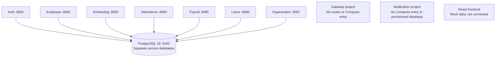

# EMS — Employee Management System

## Backend architecture and project reference

> **Current state, verified 2026-09-23.** The backend contains nine independent
> Spring Boot projects. Auth, employee, and organization have concrete HTTP APIs.
> Attendance, leave, scheduling, payroll, and notification have persistence models
> and contracts, but their business workflows are not implemented. Gateway is a
> bare application. The services are not yet connected into a working system.
>
> **Current** describes code or configuration on disk. **Planned** describes an
> intended workflow that is not implemented. **Decision pending** means the
> implementation has not been selected. Passing unit tests does not establish
> database startup or end-to-end functionality.

| Item | Current value |
| --- | --- |
| Repository / backend root | `ems-system` / `ems-services/` |
| Java target | 17 in every service POM and Docker build |
| Spring Boot parent | 4.1.1 in every service; auth has dependency overrides noted below |
| Build | Independent Maven projects; wrapper distribution 3.9.16 |
| Database configuration | PostgreSQL 18; separate databases and login roles on one server |
| Frontend | React 19, TypeScript, Vite 8, MUI 9, React Router 7 in `../frontend/` |
| Latest baseline | 100 tests: 99 passed, 1 application-context error |
| Verification limits | Database integration profile, container builds, and full-stack workflows not verified in this pass |

This document includes the baseline audit and outstanding implementation
questions and serves as the main project reference.

## Table of contents

1. [Overview](#1-overview)
2. [Status at a glance](#2-status-at-a-glance)
3. [Architecture](#3-architecture)
4. [Repository and package hierarchy](#4-repository-and-package-hierarchy)
5. [HTTP APIs and gateway](#5-http-apis-and-gateway)
6. [Security model](#6-security-model)
7. [System workflows](#7-system-workflows)
8. [Data model](#8-data-model)
9. [Organization and reporting](#9-organization-and-reporting)
10. [Integration and outstanding decisions](#10-integration-and-outstanding-decisions)
11. [Local development and verification](#11-local-development-and-verification)
12. [Remaining work](#12-remaining-work)
13. [Frontend consumers](#13-frontend-consumers)

## 1. Overview

EMS manages an hourly or shift-based workforce. Its intended capabilities are
identity and access, employee and organization records, attendance, paid time off
(PTO), scheduling, payroll, and notifications.

The backend was split from a monolithic package structure into separate service
projects. Organization is now its own service, responsible for departments and
locations. Reporting has no service project. The working tree has progressed
beyond the original scaffold, but models and interface declarations must not be
mistaken for completed workflows.

| Service | Ownership |
| --- | --- |
| Auth | Accounts, passwords, roles, access and refresh tokens |
| Employee | Workforce records and account-to-employee mapping |
| Organization | Departments and locations |
| Attendance | Recorded time, adjustments, timesheets |
| Leave | PTO types, requests, balances, ledger |
| Scheduling | Shift categories, shifts, assignments, availability |
| Payroll | Pay periods, payroll records, earnings, deductions |
| Notification | Notification records and intended event/email delivery |
| Gateway | Intended public entry point; routing not implemented |

## 2. Status at a glance

### Service implementation

“Concrete HTTP operations” counts annotated methods on implemented domain REST
controllers. It excludes controller interfaces, static documentation, and actuator
endpoints. These are source-level counts, not proof that each service starts.

| Service | Concrete HTTP operations | Current implementation | Main gaps |
| --- | ---: | --- | --- |
| Auth | 9 | Login, refresh rotation, account APIs, BCrypt, JWT encoder/decoder, security filter chain | Database startup/migrations, security wiring verification, logout, bootstrap account, configuration cleanup |
| Employee | 9 | CRUD, lookups, filtering, summary, activation, validation, transactional service, error handling | Authorization and remote department/account validation |
| Organization | 10 | Location/department CRUD, validation, errors, migrations, health configuration, static OpenAPI, unit/MVC and PostgreSQL integration tests | Authorization and checking references from other services |
| Attendance | 0 | Entities, enums, repositories, DTOs, mappers, migration, controller/service/calculation interfaces | Clock, approval, adjustment, calculation, timesheet implementations |
| Leave | 0 | Entities, enums, repositories, DTOs, mappers, migration, controller/service/validator interfaces | Reservations, approvals, cancellation, accrual, ledger workflows |
| Scheduling | 0 | Entities, enums, repositories, DTOs, mappers, migration, controller/service/validator interfaces | Shift management, availability, conflicts, assignment and publication workflows |
| Payroll | 0 | Entities, enums, repositories, DTOs, mappers, migration, controller/service/calculation interfaces | Generation, calculations, finalization, statements |
| Notification | 0 | Entity, enum, repository, DTO/mapper, migration, event records, service/listener interfaces | HTTP controller, event transport, consumers, email, retries and deduplication |
| Gateway | 0 | Application entry point, basic starter, context test | Gateway dependency, routes, JWT checks, CORS, identity propagation |

### Cross-cutting implementation

| Concern | Current state |
| --- | --- |
| Internal HTTP/gRPC clients | None; no `.proto` files or gRPC implementation |
| Broker and events | No broker, producer or consumer implementation; three event records exist |
| Database provisioning | Root Compose and init script configure seven service databases/roles |
| Migrations | Seven domain services have V1 SQL; organization also has V2; auth has no migration files |
| Migration startup | Configuration and dependencies exist in domain services; startup is not verified by the constructor tests |
| Shared modules / root build | No root `pom.xml`, `ems-common`, or protobuf-contract module |
| Containerization | All nine projects have Dockerfiles; root Compose includes seven services plus PostgreSQL |
| Gateway / notification containers | Not included in root Compose |
| Health endpoints | Organization includes actuator and readiness/liveness configuration; not implemented consistently elsewhere |
| Error responses | Employee and organization implement handlers; auth has a limited duplicate-email handler; no uniform system-wide envelope |
| Service discovery / config server | Not present |
| CI/CD | No `.github` workflow directory found at repository or backend root |
| Frontend integration | Mock data; no backend API client or login flow |

### Latest test baseline

Ran `./mvnw -B -q test` in every service on 2026-09-23.

| Service | Tests | Passed | Errors | Coverage represented |
| --- | ---: | ---: | ---: | --- |
| Auth | 20 | 19 | 1 | Authentication, controller and account unit tests; full context fails on unavailable PostgreSQL |
| Employee | 9 | 9 | 0 | Existing service, controller, validation and entity tests |
| Organization | 65 | 65 | 0 | Existing service, MVC API and entity tests |
| Attendance | 1 | 1 | 0 | Entity constructor defaults |
| Leave | 1 | 1 | 0 | Entity constructor defaults |
| Scheduling | 1 | 1 | 0 | Entity constructor defaults |
| Payroll | 1 | 1 | 0 | Entity constructor defaults |
| Notification | 1 | 1 | 0 | Entity constructor defaults |
| Gateway | 1 | 1 | 0 | Bare application context |
| **Total** | **100** | **99** | **1** | **No end-to-end verification** |

Auth's `contextLoads` test attempts to connect to `localhost:5432`; the connection
was refused, and Hibernate could not obtain JDBC metadata. This is an environment
and test-isolation failure, not a compilation failure. It does not prove that
startup will succeed once PostgreSQL is available; other wiring remains unverified.

Organization also has `OrganizationPostgresIT` under an opt-in `integration`
profile. It was not included in these 65 tests and was not run in this baseline.
Maven logs identify Java 26.0.1 for the test runtime; this run does not establish
runtime compatibility on Java 17.

## 3. Architecture

### Current deployment configuration

Root Compose configures one PostgreSQL server and seven application containers.
The diagram describes configured persistence dependencies, not observed running
services. There are no implemented service-to-service calls.



Application labels show host ports. Each configured application container listens
on port 8080. PostgreSQL and application host bindings are restricted to
`127.0.0.1`. Root Compose waits for PostgreSQL health before starting applications,
but does not define readiness health checks for those application containers.

### Service boundaries and identity

A service owns its entities and tables. Cross-service references are scalar IDs;
there are no cross-service entity imports or database foreign keys in the current
models. Local relationships, such as department-to-location, do use JPA associations
and database foreign keys inside the owning service.

- `UserAccount.id` is a UUID owned by auth.
- `Employee.id` is a Long owned by employee.
- Employee stores a nullable, unique `userAccountId` to link the two identities.
- Employee stores `departmentId`; scheduling stores `locationId` and `employeeId`.
- Attendance, leave, payroll, and notification store `employeeId`.

An account need not have an employee record. No supervisor/report relationship is
currently represented on Employee. Employee creation does not yet call auth or
organization to verify the supplied account and department IDs.

### Planned request topology

The earlier blueprint proposed a frontend calling a single gateway, with the
gateway routing to owning services. That topology remains unimplemented.
Synchronous internal gRPC, public REST, and asynchronous notification transport
are under discussion; no transport choice has been approved or wired in.

## 4. Repository and package hierarchy

```text
ems-services/
├── DOCUMENTATION.md
├── .env.example
├── docker-compose.yml
├── docker/postgres-server/init-databases.sh
├── ems-auth-service/
├── ems-employee-service/
├── ems-organization-service/
│   ├── README.md
│   └── compose.yaml                 # standalone organization stack
├── ems-attendance-service/
├── ems-leave-service/
├── ems-scheduling-service/
├── ems-payroll-service/
├── ems-notification-service/
└── ems-gateway-service/
```

Each service has its own `pom.xml`, Maven wrapper, sources, tests, and Dockerfile.
There is no root Maven reactor. The frontend is the sibling `../frontend/` project.

Domain package roots follow `com.emssystem.ems<name>service`:

```text
<domain>/
├── controller/      # Concrete REST classes or unimplemented API interfaces
├── dto/request/
├── dto/response/
├── entity/
├── enums/
├── exception/
├── mapper/
├── repository/
├── service/
├── calculation/     # Attendance and payroll interfaces
└── validation/      # Domain validation contracts where applicable
shared/              # Service-local configuration, errors and support types
```

This is a convention, not an identical tree in every project. Auth uses `auth`,
`user`, and `security` packages; notification has event/listener packages; gateway
has only its application class. Employee's service implements `IEmployeeService`;
organization uses `DefaultDepartmentService` and `DefaultLocationService` behind
interfaces.

Current models use `java.time`, scalar cross-service IDs, and `BigDecimal` for
monetary values. Most domain entities inherit audit timestamps and an optimistic
locking version. Auth and notification have their own mappings. Several services
have a UTC `Clock` bean, but auth still calls `Instant.now()` directly. Shared
configuration and exception handling have not been consolidated or made uniform.

## 5. HTTP APIs and gateway

### Port map

This table follows the actual root Compose file. It replaces the conflicting port
assignments in the previous blueprint.

| Component | Host port | Container port | Root Compose service name |
| --- | ---: | ---: | --- |
| PostgreSQL | 5432 | 5432 | `postgres` |
| Auth | 8081 | 8080 | `auth-service` |
| Employee | 8082 | 8080 | `employee-service` |
| Scheduling | 8083 | 8080 | `scheduling-service` |
| Attendance | 8084 | 8080 | `attendance-service` |
| Payroll | 8085 | 8080 | `payroll-service` |
| Leave | 8086 | 8080 | `leave-service` |
| Organization | 8087 | 8080 | `organization-service` |
| Gateway | Not mapped | Not configured as a gateway | Not present |
| Notification | Not mapped | No Compose configuration | Not present |

The old gateway 8080 and notification 8088 assignments were proposals, not current
host mappings. Direct Maven runs need explicit `SERVER_PORT` values to avoid
collisions; Compose's host mappings do not apply outside containers.

### Implemented auth API

Source: `ems-auth-service/src/main/java/com/emssystem/emsauthservice/`.

| Method | Path | Access / operation |
| --- | --- | --- |
| POST | `/api/v1/auth/login` | Public; credentials to access/refresh token pair |
| POST | `/api/v1/auth/refresh` | Public; refresh token rotation |
| GET | `/api/v1/accounts/me` | Authenticated account profile |
| PATCH | `/api/v1/accounts/me/password` | Authenticated; verify current password and replace it |
| PATCH | `/api/v1/accounts/me/profile` | Authenticated; update email |
| POST | `/api/v1/admin/accounts` | ADMIN; create account |
| GET | `/api/v1/admin/accounts/{accountId}` | ADMIN; retrieve account |
| PATCH | `/api/v1/admin/accounts/{accountId}/role` | ADMIN; change role |
| PATCH | `/api/v1/admin/accounts/{accountId}/status` | ADMIN; change account status |

There is no logout endpoint, public registration endpoint, or account-list endpoint.
Account creation requires an existing administrator; no application bootstrap or
seed migration for the first administrator was found.

### Implemented employee API

| Method | Path | Operation |
| --- | --- | --- |
| POST | `/api/employees` | Create; 201 with Location header |
| GET | `/api/employees/{id}` | Retrieve |
| GET | `/api/employees/by-number/{employeeNumber}` | Lookup by normalized employee number |
| GET | `/api/employees/by-account/{userAccountId}` | Lookup by account UUID |
| GET | `/api/employees` | Page with optional `active` and `departmentId` filters |
| PUT | `/api/employees/{id}` | Replace details |
| POST | `/api/employees/{id}/activate` | Activate |
| POST | `/api/employees/{id}/deactivate` | Deactivate |
| GET | `/api/employees/summary` | Total, active, and inactive counts |

Listing defaults to 20 records sorted by `lastName` and returns a Spring Data
`Page<EmployeeResponse>`. Email is trimmed/lowercased; employee number is
trimmed/uppercased. The service checks duplicate email, number, and account link.
`jobTitle` is already part of the entity and response. Authentication, caller
ownership checks, and remote reference validation are absent.

### Implemented organization API

| Method | Path | Operation |
| --- | --- | --- |
| POST / GET | `/api/locations` | Create / list |
| GET / PUT / DELETE | `/api/locations/{id}` | Retrieve / replace name / delete |
| POST / GET | `/api/departments` | Create / list, optionally filtered by `locationId` |
| GET / PUT / DELETE | `/api/departments/{id}` | Retrieve / replace / delete |

Locations accept `{"name":"Calgary"}`. Departments accept
`{"name":"Operations","locationId":1}`. Creation returns 201 with a Location
header; deletion returns 204. Lists are ordered by ID. Department responses include
location ID and name. See [organization README](ems-organization-service/README.md)
and its [OpenAPI contract](ems-organization-service/src/main/resources/static/openapi.json)
for details. Authentication and role authorization are absent.

### Declared APIs without implementations

These mappings exist on interfaces only. They do not register usable HTTP handlers
without implementing controller beans.

| Service | Declared paths and operations |
| --- | --- |
| Attendance | `/api/time-entries`: clock-in/out, get/list, approve/reject/adjust; `/api/timesheets/me`, `/api/timesheets/summary` |
| Leave | `/api/pto/types`: create/get/list/replace/delete; `/api/pto/requests`: create/get/list/mine/decision/cancel; `/api/pto/balances`: mine/by-employee/adjust |
| Scheduling | `/api/shifts`: create/get/list/replace/publish/cancel/summary/assign/respond; `/api/shift-assignments/{id}/cancel`; `/api/shift-categories`: CRUD-like operations and activation; `/api/availability`: create/mine/replace/delete |
| Payroll | `/api/pay-periods`: create/get/list; `/api/payroll`: generate/finalize, record get/list, earnings/deductions, own statements and statement lookup |
| Notification | No HTTP controller contract; service interface declares create, list, and mark-read operations |

Several interface methods accept `X-User-Id`. No gateway currently strips, verifies,
or supplies that header, and no downstream identity trust mechanism is implemented.

### Gateway status

`ems-gateway-service` has no Spring Cloud Gateway dependency, route table, filter,
CORS configuration, JWT validation, or actuator dependency. Its context test only
starts the bare application. No public gateway API is available.

Future routing must send departments **and** locations to organization. Existing
auth paths use `/api/v1`, while other APIs use `/api`. Standardizing those prefixes
is a pending decision; this document does not redefine the current contracts.

## 6. Security model

### Current auth implementation

`RoleType` contains `EMPLOYEE`, `SUPERVISOR`, `MANAGER`, and `ADMIN`.
`AccountStatus` contains `ACTIVE`, `SUSPENDED`, and `DISABLED`. UserAccount stores
the role enum directly; it does not require the old proposed AccountRole model.

Auth has BCrypt password hashing, a stateless `SecurityFilterChain`, method-security
annotations, a Nimbus JWT encoder/decoder, and resource-server support. Login and
refresh paths are public; admin paths require ADMIN; account paths require
authentication. The decoder checks HS256 signatures and issuer/timestamp validity.
CORS defaults to `http://localhost:5173` and is configured in auth through
`app.security.allowed-origins`.

The filter chain requires an injected `JwtAuthenticationConverter`; no application
bean declaration for it was found. Full startup and mapping the `role` claim to
Spring authorities remain to be verified/fixed. The baseline context test fails
earlier while connecting to PostgreSQL.

### Actual token contract

| Property | Access token | Refresh token |
| --- | --- | --- |
| Format | HS256 JWT | Opaque random token, not a JWT |
| Configured/default lifetime | 15 minutes (`PT15M`) | 30 days (`P30D`) |
| Contents | `sub`, `email`, `role`, `iat`, `exp`, `jti`, `iss`, `token_type=access` | 64 random bytes encoded with URL-safe Base64 |
| Server-side storage | No access-token record | SHA-256 hash, account link, creation/expiry/revocation timestamps |
| Usage | Bearer Authorization header | `refreshToken` in refresh request body |
| Rotation | New access token on login/refresh | Old token revoked and replacement issued under a transaction and row lock |

Login and refresh return `accessToken`, `refreshToken`, `tokenType` (`Bearer`), and
`expiresAt`; responses set no-store/no-cache headers. Login checks the password and
requires an active account. Refresh rejects unknown, revoked, and expired tokens;
AuthenticationService also checks that the returned account is active.

The JWT settings use the **`security.jwt.*`** prefix. The signing secret is Base64
and must decode to at least 32 bytes. The previous document's `ems.jwt.*` prefix,
7-day refresh lifetime, JWT refresh claims, and token response containing `role`
do not describe the current implementation.

### Limits and unfinished security work

- Auth properties contain literal development credentials and a JWT secret;
  configuration cleanup is outstanding. Their values are not reproduced here.
- Logout, session-wide refresh revocation, and an initial-admin bootstrap flow
  are not implemented.
- Login does not explicitly update `lastLoginAt`. The entity currently annotates
  that field with `@LastModifiedDate`; it is not a verified login audit trail.
- Employee and organization APIs have no authentication/authorization layer.
- Ownership, supervisor/report checks, and role enforcement for the unimplemented
  workflows have not been written.
- The old trusted `X-User-*` gateway design is a proposal, not an active security
  boundary. Gateway-only versus per-service JWT validation and internal caller
  authentication still need decisions.

The intended business role scopes remain employee self-service, supervisor review
of reports, manager scheduling/payroll, and administrator account management.
Only the auth account authorization rules are currently implemented; a general
role hierarchy or reporting relationship must not be inferred from the enums.

## 7. System workflows

### 7.1 Login and refresh — implemented service logic

Login normalizes the email, loads the account, checks BCrypt and ACTIVE status,
issues an access token, and stores a hash of a newly generated refresh token.
Refresh hashes the presented token, locks the matching record, validates expiry
and revocation, revokes it, and creates a replacement. These methods have unit
tests; the complete database-backed login path has not been verified in this pass.

The caller currently reaches auth directly. The previous sequence diagram's
gateway hop and explicit login timestamp update are not implemented.

### 7.2 Employee and organization management — implemented locally

Employee requests validate DTOs and unique fields, persist employee data, and
return DTOs. Organization requests validate names and local location references,
persist locations/departments, and translate domain/database errors to HTTP.
Neither flow contacts another service. A valid-looking scalar ID is not proof
that the remote record exists.

### 7.3 Attendance — planned workflow

The intended flow is active employee lookup, clock-in with one open entry,
clock-out and worked/overtime calculation, then supervisor approval or adjustment.
Timesheets and payroll would use the resulting approved time. Interfaces, fields,
and error types exist; the workflow and state transitions do not.

`TimeEntryAdjustment` stores original clock values, actor, reason, and timestamp.
How effective corrected values, reapproval, and payroll locks interact is still
an implementation decision. Overtime, break, rounding, timezone, and overnight
rules are not specified by the current calculator interfaces.

### 7.4 PTO — planned workflow

The blueprint calls for overlap and balance checks, balance reservation when a
request is submitted, usage/ledger commitment on approval, reservation release
on rejection, and a notification event after review. The data model supports
these concepts but no reservation, review, cancellation, or accrual logic exists.

The current request DTO includes explicit `hours` as well as type and dates.
Accrual cadence, carryover timing, eligibility, cancellation/reversal rules, and
paid/unpaid treatment remain unspecified.

### 7.5 Scheduling — planned workflow

The intended flow is draft shift creation, employee/location validation,
availability/conflict checks, assignment, publication, and employee acceptance
or decline. Interfaces and status enums exist; none of those workflows is wired.

Notification timing needs a decision: the earlier blueprint described both an
assignment event and notification only on publication. Maximum shift length,
rest gaps, missing availability, staffing capacity, and PTO conflicts also need
explicit rules.

### 7.6 Payroll — planned workflow

Payroll is intended to retrieve employees/rates and approved attendance, reject
periods with unapproved time, calculate regular and overtime earnings, apply
additional earnings/deductions, and create draft records. Finalization is intended
to close the period and make its records immutable, with later corrections in a
subsequent period.

None of generation, finalization, statement access, or calculation is implemented.
An approved-time query alone does not establish a stable snapshot: coordination
with attendance, pay-rate history, repeat generation, and concurrent corrections
still require a design. Existing enum values do not enforce immutability.

### 7.7 Notification delivery — planned workflow

Three Java event records exist: `PtoReviewedEvent`, `ShiftAssignedEvent`, and
`SchedulePublishedEvent`. All carry `eventId` and `occurredAt` plus domain IDs;
schedule publication carries a list of employee IDs. Listener and email services
are interfaces. There is no event publishing, durable delivery, SMTP adapter,
retry handling, or consumer deduplication implementation.

## 8. Data model

The following describes existing entity fields and migrations. Except where
noted, IDs are generated Long values, temporal fields use `java.time`, and domain
entities inherit `createdAt`, `updatedAt`, and optimistic-lock `version` fields.
Local entity relationships stay within a service's database.

### 8.1 Auth

| Entity | Existing fields / mapping |
| --- | --- |
| `UserAccount` | UUID `id`; unique `email`; `passwordHash`; `status` enum stored in column `active`; `role` enum; `createdAt`, `updatedAt`, `lastLoginAt` |
| `RefreshToken` | UUID `id`; account relationship; unique 64-character `tokenHash`; `createdAt`, `expiresAt`, nullable `revokedAt` |

UserAccount has methods to change password, role, status, and email. Its audit
mapping differs from the domain base entity and needs database-backed verification.
Auth has no Flyway migrations. The `.properties` file requests Hibernate `update`,
while YAML requests `validate`; see the configuration section below.

### 8.2 Employee

| Fields | Details |
| --- | --- |
| `id`, `employeeNumber` | Generated ID; unique business number |
| `firstName`, `lastName`, `email` | Required names; unique email |
| `phoneNumber`, `address`, `birthDate`, `hireDate` | Phone stored as `contact_number`; hire date required |
| `departmentId` | Required positive scalar organization reference |
| `role`, `userAccountId` | EmployeeRole enum; nullable unique UUID account link |
| `payRate`, `jobTitle`, `active` | Decimal pay rate, optional job title, boolean lifecycle status |

V1 creates `employees`, unique constraints, positive-department and nonnegative-rate
checks, and department/active indexes. There is no supervisor ID, effective-dated
pay history, or stored “On Leave” state.

### 8.3 Organization

`Location` stores `id` and unique `name`. `Department` stores `id`, unique
`departmentName` (column `department_name`), and a required local `Location`
relationship. V1 creates both tables and audit/version fields; V2 adds unique
indexes on lowercase names. There is no location entity in employee service.

### 8.4 Attendance

| Entity | Existing domain fields |
| --- | --- |
| `TimeEntry` | `employeeId`, `clockIn`, nullable `clockOut`, `source`, `status`, `workedMinutes`, `overtimeMinutes` |
| `TimeEntryAdjustment` | Local time-entry relationship, `adjustedBy` UUID, original clock-in/out, `reason`, `adjustedAt` |

`TimeEntryStatus`: `OPEN`, `PENDING_APPROVAL`, `APPROVED`, `REJECTED`.
`ClockSource`: `WEB`, `MOBILE`, `KIOSK`, `MANUAL`. Both are implemented enums.
V1 creates both tables and lookup indexes; it does not enforce one open entry per
employee. That concurrency invariant still needs implementation.

### 8.5 Leave

| Entity | Existing domain fields |
| --- | --- |
| `PtoType` | Unique `name`, `accrualRatePerPeriod`, `maxCarryover`, `paid` |
| `PtoRequest` | `employeeId`, PTO type relationship, `startDate`, `endDate`, `hours`, `status`, `reviewedBy`, `reviewedAt` |
| `PtoBalance` | Employee/type pair, `accruedHours`, `usedHours`, `reservedHours`; unique pair constraint |
| `PtoLedgerEntry` | Employee/type, `hoursDelta`, `entryType`, optional source request, `occurredAt` |

Request status: `PENDING`, `APPROVED`, `REJECTED`, `CANCELLED`.
Ledger type: `ACCRUAL`, `USAGE`, `ADJUSTMENT`, `REVERSAL`.
V1 creates all four tables. Balances and ledger entries exist structurally; no
implemented workflow keeps them synchronized or prevents duplicate accrual runs.

### 8.6 Scheduling

| Entity | Existing domain fields |
| --- | --- |
| `ShiftCategory` | Unique `name`, `color`, default start/end times, `active` |
| `Shift` | Category relationship, `startsAt`, `endsAt`, `status`, scalar `locationId`, integer `requiredEmployees` |
| `ShiftAssignment` | Shift relationship, scalar `employeeId`, `status`, `respondedAt`; unique shift/employee pair |
| `EmployeeAvailability` | `employeeId`, DayOfWeek enum, `startTime`, `endTime`, availability type |

Shift status: `DRAFT`, `PUBLISHED`, `CANCELLED`.
Assignment status: `ASSIGNED`, `ACCEPTED`, `DECLINED`, `CANCELLED`.
Availability type: `AVAILABLE`, `UNAVAILABLE`, `PREFERRED`.
V1 includes shift location/start and status/start indexes, assignment employee
index, and availability employee/day index. Availability uses local recurring
times; the timezone policy has not been defined.

### 8.7 Payroll

| Entity | Existing domain fields |
| --- | --- |
| `PayPeriod` | `startDate`, `endDate`, `payDate`, `status`; unique start/end pair |
| `PayrollRecord` | Period relationship, `employeeId`, regular/overtime hours, gross/net pay, status; unique period/employee pair |
| `PayrollEarning` | Record relationship, earning type, amount, description |
| `PayrollDeduction` | Record relationship, deduction type, amount, description |

Period status: `OPEN`, `PROCESSING`, `CLOSED`.
Record status: `DRAFT`, `FINALIZED`, `PAID`.
Earnings: `REGULAR`, `OVERTIME`, `BONUS`, `HOLIDAY`, `PTO`.
Deductions: `TAX`, `INSURANCE`, `RETIREMENT`, `GARNISHMENT`, `OTHER`.
V1 creates these tables. Monetary fields use `BigDecimal`/`NUMERIC(19,2)`;
regular/overtime hours use `NUMERIC(10,2)`. No tax engine or payment integration
is implemented or implied by these enums.

### 8.8 Notification

`Notification` contains `id`, `employeeId`, `type`, `title`, `body`, nullable
`readAt`, and `createdAt`. Its V1 table has an employee/creation-time index and does
not use the common domain audit/version columns.

Notification types are implemented enums: `PTO_REVIEWED`, `SHIFT_ASSIGNED`,
`SCHEDULE_PUBLISHED`, `TIMESHEET_APPROVED`, `PAYSTATEMENT_AVAILABLE`.
The last two types have no corresponding event records yet. The table has no
processed-event ID or delivery-attempt model.

## 9. Organization and reporting

### Organization behavior

Organization owns `/api/departments` and `/api/locations`. Names are stripped of
surrounding whitespace, must be nonblank and at most 100 characters, and are unique
ignoring case. Database indexes protect against concurrent duplicate creates.
V2 does not automatically rename or remove conflicting legacy rows.

Departments require a valid local location and can move between locations.
Deleting a location with departments returns a conflict. Deleting a department
does **not** check employee references held in the employee service.

The service implements strict JSON validation and structured responses for
validation, missing resources, conflicts, unsupported methods/content types, and
unexpected failures. Its standalone stack includes readiness checks and graceful
shutdown. Details and commands are in its README.

### Reporting status

There is no reporting service, cross-domain read model, CSV export, or PDF export.
Employee's summary endpoint is implemented. Attendance and scheduling summary
methods are interfaces. Frontend dashboard content is not populated from backend
summary APIs. The previous proposal to add reporting later remains a proposal;
its inclusion in the completion scope is unresolved.

## 10. Integration and outstanding decisions

### Current database layout

[Root Compose](docker-compose.yml) runs `postgres:18`.
[The initialization script](docker/postgres-server/init-databases.sh) creates
missing databases and login roles; it does not update existing role passwords.

| Service | Database | Login role | Root Compose provisioning |
| --- | --- | --- | --- |
| Auth | `ems_auth_db` | `auth_user` | Yes |
| Employee | `ems_employee_db` | `employee_user` | Yes |
| Scheduling | `ems_schedule_db` | `schedule_user` | Yes |
| Attendance | `ems_attendance_db` | `attendance_user` | Yes |
| Payroll | `ems_payroll_db` | `payroll_user` | Yes |
| Leave | `ems_leave_db` | `leave_user` | Yes |
| Organization | `ems_organization_db` | `organization_user` | Yes |
| Notification | `ems_notification_db` | `notification_user` | No; application configuration only |

Each role owns its database. The script does not implement a comprehensive grants
hardening policy. There is no configured schema-per-service layout. Service-local
migrations create tables without cross-service foreign keys.

The PostgreSQL data volume is mounted at `/var/lib/postgresql`. Initialization
scripts run for a fresh data directory; changing the script or `.env` does not
re-provision an existing volume. The corrected bind mount uses
`docker/postgres-server/init-databases.sh`.

### Potential internal dependencies — not implemented

| Caller | Owner of required data | Purpose |
| --- | --- | --- |
| Employee | Organization / auth | Validate department and linked account |
| Attendance | Employee | Resolve account to active employee and review scope |
| Leave | Employee | Resolve employee identity, eligibility and review scope |
| Scheduling | Employee / organization | Validate employee and location |
| Scheduling | Leave | PTO conflicts, if selected as a business rule |
| Payroll | Employee / attendance | Employee/rate inputs and approved time |
| Payroll | Leave | Paid leave inputs, if included in payroll scope |
| Notification | Employee | Resolve recipient contact details |

The earlier OpenFeign-first and RabbitMQ proposals have not been implemented.
The user has requested considering gRPC where needed. No protobuf contracts,
channels, interceptors, deadlines, retries, service credentials, event exchange,
or routing keys are configured. In particular, the previously suggested
`ems.events` exchange is not an existing resource.

### Decisions not yet made

| Decision | What must be settled |
| --- | --- |
| Completion scope | Nine backend services, tests, Docker and docs; whether frontend and reporting are included |
| Internal transport | gRPC boundaries and contracts; whether a broker handles notifications |
| Database layout | Preserve separate databases or migrate to schemas; treatment of existing data |
| API prefixes | Preserve existing paths or standardize `/api/v1` |
| Shared build | Root Maven reactor, shared infrastructure, and protobuf modules versus independent builds |
| Security | Gateway/per-service validation, internal caller authentication, trusted headers, first-admin provisioning |
| Reporting hierarchy | Explicit supervisor assignment versus another approved model |
| Attendance | Timezone, workweek, overtime, breaks, rounding, overnight work, corrections |
| Leave | Accrual cadence, carryover, eligibility, requested hours, cancellation, unpaid leave |
| Scheduling | Rest gaps, capacity, availability defaults, PTO conflicts, notification timing |
| Payroll | Currency, rounding, multipliers, taxes/deductions, historical rates, snapshots and finalization coordination |
| Notifications | In-app/email scope, provider, durable delivery, retries and deduplication |

These items are not defaults. No decision is implied by an example, a DTO field,
or an enum. Shared-library extraction, service discovery, and configuration-server
changes are likewise not present in the repository.

## 11. Local development and verification

### Prerequisites and build configuration

The POMs target Java 17 and use the bundled Maven wrappers. Docker/Compose is
required for container workflows and organization's PostgreSQL integration tests.
There is no root `mvn test` command because no root POM exists.

Auth's POM overrides the web starter to `4.2.0-M1`, uses a dynamic `RELEASE`
version for JetBrains annotations, and includes a web MVC test artifact outside
test scope. These differ from the common parent baseline and need reconciliation.
Organization explicitly uses the Boot Flyway starter and actuator. Other domain
POMs contain Flyway core/PostgreSQL modules; migration files and `enabled: true`
alone are not evidence that startup migration has been tested.

### Root Compose

From `ems-services/`, create `.env` from `.env.example` **only if `.env` does not
already exist**, then fill in the eight required password variables:
`POSTGRES_ADMIN_PASSWORD`, `AUTH_DB_PASSWORD`, `EMPLOYEE_DB_PASSWORD`,
`SCHEDULE_DB_PASSWORD`, `ATTENDANCE_DB_PASSWORD`, `PAYROLL_DB_PASSWORD`,
`LEAVE_DB_PASSWORD`, and `ORGANIZATION_DB_PASSWORD`.

Validate configuration without printing resolved credentials:

```sh
docker compose config --quiet
```

To start the configured database:

```sh
docker compose up -d postgres
```

To build and attempt startup of the currently configured application set:

```sh
docker compose up --build -d
```

The latter starts only the seven configured services, not gateway or notification.
It is not a verified full-stack setup: several services have no workflows, and
database/migration/startup issues remain. This documentation update did not run
container builds or start database containers.

### Configuration when running a service directly

Employee, organization, attendance, leave, scheduling, payroll, and notification
YAML files accept `DB_URL`, `DB_USERNAME`, and `DB_PASSWORD`, with local defaults.
Those defaults are not automatically populated from root `.env` by Maven.
Root Compose instead injects `SPRING_DATASOURCE_URL`,
`SPRING_DATASOURCE_USERNAME`, and `SPRING_DATASOURCE_PASSWORD` for its containers.

Set the appropriate datasource variables and a distinct `SERVER_PORT`, then run
inside the selected service directory:

```sh
./mvnw spring-boot:run
```

Auth needs special attention: `application.properties` contains a localhost
datasource and `ddl-auto=update`, while `application.yml` uses required `DB_*`
placeholders and `ddl-auto=validate`. Same-location properties take precedence
over YAML for overlapping keys. Explicit environment overrides are needed to
avoid unintentionally using the properties-file datasource/DDL setting. Auth
also declares Flyway/health settings without the corresponding Flyway/actuator
starters. Those settings do not establish migrations or health endpoints.

JWT properties are `security.jwt.secret`, `security.jwt.issuer`,
`security.jwt.access-token-ttl`, and `security.jwt.refresh-token-ttl`.
The existing literal secret and database credentials must be externalized as part
of completing auth; do not copy their values into documentation or examples.

### Standalone organization stack

Organization has a separate Compose file with its own database volume and service
readiness health check:

```sh
cd ems-organization-service
docker compose up --build --wait
```

It uses `postgres:18-alpine`, defaults to host port 8087, and accepts
`ORGANIZATION_PORT` and `DB_PASSWORD`. It does not depend on the root platform
stack. Avoid using the same host port for both organization stacks simultaneously.
See the [service README](ems-organization-service/README.md) for lifecycle details.

### Tests

Run existing unit/API tests from an individual service directory:

```sh
./mvnw test
```

Run organization's opt-in PostgreSQL tests from its directory:

```sh
./mvnw -Pintegration verify
```

That profile requires a running Docker daemon and uses an isolated PostgreSQL 18
container. Its source covers migrations, startup, real HTTP CRUD/health checks,
constraints, auditing, rollback, and concurrency. It fails rather than silently
skipping when Docker is unavailable. Its execution is not part of the latest
baseline reported in section 2.

Reports are under each module's `target/surefire-reports/`; integration-profile
reports use `target/failsafe-reports/`. The audit's temporary console logs are in
`/tmp/ems-<service>-baseline.log` and should not be treated as durable artifacts.

### API documentation and health

Organization serves its static contract at `/openapi.json` and configures
`/actuator/health`, `/actuator/health/liveness`, and
`/actuator/health/readiness`; readiness includes the database. Auth declares a
springdoc dependency, but authenticated startup and Swagger access were not
verified. There is no system-wide Swagger aggregation or health API.

### Checks performed for the current baseline

- All nine Maven test suites were run; results and limitations are in section 2.
- `docker compose config --quiet` passed after correcting the initialization path.
- The PostgreSQL initialization script passed `bash -n` syntax checking.
- Container builds, database integration tests, Java 17 runtime execution, and
  complete business flows remain unverified.

## 12. Remaining work

The sequence below describes dependencies between unfinished work. It does not
select the outstanding architecture or business-policy decisions.

| Stage | Remaining work | Completion evidence needed |
| --- | --- | --- |
| Foundation | Resolve build/configuration drift, database migration startup, API conventions and internal contracts | Reproducible builds and database-backed startup |
| Auth and gateway | Complete auth wiring/migrations/bootstrap/logout; implement gateway and agreed security model | Authenticated routing, role/ownership checks and negative security tests |
| Employee and organization | Add authorization and cross-service reference rules | Authorized CRUD and invalid-reference/concurrency tests |
| Attendance | Implement clock, approval, adjustment and time calculations | Policy tests, duplicate-clock protection and PostgreSQL workflow tests |
| Leave | Implement reservations, review, accrual, cancellation and ledger updates | Balance invariants, concurrency and idempotent accrual tests |
| Scheduling | Implement shifts, categories, availability, conflicts and publication | Assignment/publishing workflows and conflict/concurrency tests |
| Payroll | Implement input retrieval, calculations, generation, statements and finalization | Stable inputs, repeated-run behavior and immutability tests |
| Notifications | Implement chosen event transport, recipients, delivery and history APIs | Duplicate/retry handling and delivery-failure tests |
| Full stack | Add missing Compose services, verify deployment, align docs and optional frontend scope | End-to-end flows across the agreed service boundaries |

Reporting and exports remain unimplemented and outside any confirmed completion
scope. Existing employee/organization APIs should be extended rather than described
as empty scaffolds or rebuilt on that premise.

## 13. Frontend consumers

The sibling frontend declares React 19, Vite 8, MUI 9, React Router 7 and TypeScript
6. It uses mock employee rows and dashboard content. No `fetch`/axios API client,
API base URL, token storage, login route, or refresh interceptor was found in its
current source. Backend availability does not yet change the displayed data.

| Route | Page | Current integration |
| --- | --- | --- |
| `/dashboard` | `SupervisorDashboard` | UI exists; not connected to backend summaries |
| `/employees` | `EmployeeManagementPage` | Mock employee array |
| `/attendance` | `AttendancePage` | Placeholder |
| `/schedule` | `SchedulePage` | Placeholder |
| `/pto` | `PTOPage` | Placeholder |
| `/payroll` | `PayrollPage` | Placeholder |

The frontend and backend employee shapes still differ:

| Frontend field | Current backend counterpart / missing integration |
| --- | --- |
| `name` | Combine `firstName` and `lastName` |
| `department` string | Resolve `departmentId` through organization |
| `position` | `jobTitle` now exists; mapping remains to be wired |
| `phone` | `phoneNumber` |
| `status`: Active / On Leave / Inactive | `active` boolean; leave-derived state not implemented |
| `openRequests` | No employee response field; leave integration needed |
| No corresponding mock fields | `employeeNumber`, address, birth date, pay rate, account link, role |

Future integration needs an agreed public API base URL, authentication flow, API
client, and response mapping. The old suggestion to point the frontend at a
working gateway on port 8080 is not a runnable instruction today.

---

Updated from the current working tree and the 2026-09-23 verification results.
Planned behavior and unresolved decisions above are not implementation claims.
