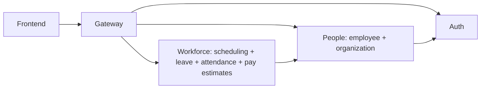

# EMS resource benchmark and AWS Fargate assessment

**Measured 2026-09-30 UTC / September 29 Edmonton. No AWS deployment was performed.**

**Recommendation: consolidate toward four applications: gateway, auth, people, and workforce.** Merge employee + organization first; merge scheduling + leave next. Include attendance and the current payroll-estimate feature in workforce once those boundaries are stable. Do not deploy the notification scaffold yet. The strongest reasons are reduced runtime overhead and simpler business transactions, not an assumption that fewer containers automatically run faster.

The eight current applications consumed **3.06 GiB at idle** and **3.28 GiB on average during the 50 requests/s phase**, excluding PostgreSQL. Their sampled CPU means summed to **4.72 cores** under that workload. Fargate charges for reserved capacity, so idle usage does not translate into an idle-price discount. [AWS pricing](https://aws.amazon.com/fargate/pricing/)

## Measured resources by service

CPU percentages below are relative to **one CPU core**: 100% = one core. Memory is Docker cache-adjusted usage, not Java heap size. “Load” is the unrestricted mixed workload offering 50 requests/s. Values are sampled means and maxima, not continuous peak capture.

| Service | Idle RAM MiB | Load mean RAM MiB | Load max RAM MiB | Idle CPU % | Load mean CPU % | Load max CPU % |
|---|---:|---:|---:|---:|---:|---:|
| attendance | 433.6 | 508.1 | 552.3 | 2.10 | 104.17 | 142.79 |
| auth | 378.4 | 384.6 | 394.2 | 2.97 | 27.81 | 96.39 |
| employee | 500.6 | 527.5 | 565.2 | 1.76 | 57.74 | 125.21 |
| gateway | 239.1 | 270.1 | 286.7 | 3.06 | 85.11 | 160.22 |
| leave | 415.1 | 426.6 | 430.3 | 2.37 | 43.31 | 88.50 |
| organization | 386.6 | 400.1 | 404.8 | 3.28 | 50.67 | 113.67 |
| payroll | 388.5 | 440.3 | 446.3 | 2.01 | 64.47 | 96.04 |
| scheduling | 394.6 | 398.8 | 402.1 | 2.13 | 38.47 | 113.02 |
| postgres | 239.7 | 245.5 | 247.7 | 4.29 | 41.28 | 104.42 |

The sum of individual application memory maxima was 3.40 GiB; this is not a simultaneous system peak. PostgreSQL used 239.7 MiB idle and 247.7 MiB at its sampled maximum in this phase. Notification is **not measured** because it is absent from the deployable stack.

**Database connections:** 70 application connections at idle, 10 per database-backed service. **Image sizes:** roughly 119–159 MiB per application according to Docker image inspection; layers may be shared. Raw statistics also retain cumulative network/block I/O and thread/process counts, but this was not an I/O capacity benchmark.

## Request performance

Fixtures: 50 employees, 20 shifts, 700 attendance entries, one department/location/PTO type, and no PTO requests. Nine equally weighted GET routes through the gateway include payroll estimates for all 50 employees. The traffic mix is deliberately report-heavy.

| Scenario | Requests | Success | Achieved req/s including drain | p50 ms | p95 ms | p99 ms | Payroll p95 ms |
|---|---:|---:|---:|---:|---:|---:|---:|
| load20 | 1200 | 1200 | 20.01 | 73 | 1713 | 12127 | 12444 |
| load50 | 3000 | 3000 | 47.50 | 91 | 2433 | 5036 | 5238 |
| capped50 | 3000 | 3000 | 39.71 | 33 | 5835 | 9136 | 10596 |

The constrained run's p95 measured from **scheduled arrival**, including client queueing, was **12246 ms**. Its status counts were `{'200': 3000}`. Baseline latency starts when an executor worker begins the HTTP request and excludes client queueing. The client has 32 workers; these results are not a maximum-capacity certification.

The constrained warm-up had **12 HTTP 503 responses out of 300 requests** (six leave, six payroll), despite healthy containers. The later capped load completed all requests successfully, but accumulated client queueing. All baseline load requests returned HTTP 200. Payroll p95 improved in the later, heavier phase; warm-up/JIT, cache effects, run order, GC, and desktop variability mean this is **not** evidence that heavier load improves performance. Even without errors, multi-second report latency needs attention.

**Most actionable code bottleneck:** `PayrollEstimateService.report()` lists employees, then makes one sequential attendance RPC per employee. With 50 employees, each report makes 50 attendance calls plus the employee lookup. At the offered 50 req/s mix, payroll alone can generate about 278 attendance RPC/s. The observed high attendance CPU is consistent with this amplification; the benchmark does not isolate it as the sole cause of all latency. Bulk attendance retrieval should be tested before merely increasing task sizes. A batch RPC can address this in the existing architecture; consolidation is not a prerequisite for that optimization.

## Constrained deployment check

All application containers were recreated with **0.5 vCPU, 1 GiB RAM**, and heap percentages of 60% maximum / 15% initial. PostgreSQL stayed unrestricted. This is a local resource-limit test, not an AWS hardware or network emulation. The heap configuration and JVM CPU ergonomics also changed, so it is not a controlled CPU-only comparison.

| Service | Capped load mean CPU % of one core | Capped load max RAM MiB | Startup unrestricted seconds | Startup capped seconds |
|---|---:|---:|---:|---:|
| attendance | 49.74 | 379.3 | 43.7 | 39.5 |
| auth | 9.50 | 327.9 | 22.3 | 46.4 |
| employee | 27.11 | 346.0 | 20.9 | 44.7 |
| gateway | 37.81 | 245.8 | 3.3 | 12.7 |
| leave | 18.38 | 318.7 | 38.2 | 38.8 |
| organization | 18.16 | 312.3 | 19.9 | 38.3 |
| payroll | 28.78 | 325.2 | 14.1 | 31.4 |
| scheduling | 12.88 | 299.5 | 42.3 | 36.9 |

A separate capped login probe completed **60/60** login flows successfully, at an offered two flows/s; p95 including CSRF retrieval was **395 ms**. Auth CPU in the mixed GET run mostly represents CSRF handling and background activity, not password hashing.

No application container was OOM-killed or restarted during the capped run; all eight were healthy at its end. Cgroup counter deltas across the capped measurement window show attendance throttled in **74.7% of active quota periods**, gateway in 36.7%, and employee in 36.1%. These percentages are not percentages of wall time spent stalled. Together with the request results, they support prioritizing CPU and payroll call amplification over simply adding memory. See `throttling-summary.json` for the raw deltas.

Startup durations above are Spring application log durations, not image-pull-to-ready times. Startup ordering and simultaneous work differ between runs. Full readiness also requires health-check detection.

## Fargate sizing and cost scenarios

**Do not choose eight minimum 0.25-vCPU / 0.5-GiB tasks based on idle averages.** Some unrestricted services already exceed 512 MiB, and several services need more than half a CPU during the report-heavy phase. The tested 0.5-vCPU / 1-GiB configuration did not sustain the offered 50 requests/s: completion fell to 39.7 requests/s with substantial queueing. It is not a validated production size for that workload. Final sizing requires an agreed latency target and a cloud workload test. For a next capacity test, increase CPU on attendance first and then gateway/payroll/employee as indicated by throttling and route latency. Consider 1 vCPU / 2 GiB per busy service, or 2 vCPU / 4 GiB for attendance if targeting this workload with headroom; none of those larger Fargate allocations were benchmarked here.

Application compute only, USD/month, 730 hours, US East (N. Virginia), on-demand. “Two replicas” doubles application allocation; it does not include database redundancy or prove failover capacity.

| Allocation scenario | Total vCPU / GiB per replica set | ARM one replica | ARM two replicas | x86 one replica |
|---|---:|---:|---:|---:|
| 8 × 0.25 CPU / 0.5 GiB — arithmetic floor, not recommended | 2 / 4 | $57.67 | $115.34 | $72.08 |
| 8 × 0.5 CPU / 1 GiB — locally tested | 4 / 8 | $115.34 | $230.68 | $144.16 |
| 8 × 1 CPU / 2 GiB — untested capacity allowance | 8 / 16 | $230.68 | $461.36 | $288.32 |
| 4 merged apps — unbuilt planning scenario | 3.5 / 7 | $100.92 | $201.84 | $126.14 |

The four-application model reserves 0.5 CPU / 1 GiB each for gateway, auth, and people, plus 2 CPU / 4 GiB for workforce. At those explicit assumptions, compute is $100.92/month ARM, only $14.42/month below the eight small tasks. Larger savings require proving that consolidation reduces the needed total allocation. Do not promise a 50% bill reduction just because the service count halves. [Rate source](https://aws.amazon.com/fargate/pricing/)

For illustration, eight small ARM tasks ($115.34), one ALB base ($16.43), one average LCU ($5.84), two ALB IPv4 addresses ($7.30), and one $0.045/hour NAT gateway plus its address ($36.50) total **about $181.41/month before RDS, logs, storage, traffic charges, secrets, and frontend hosting**. This is not a complete quote; region and networking choices remain assumptions. See the deployment notes below for sources and exclusions.

## Project breadth

| Module | Main Java files | Physical Java lines | Entity annotations | REST controller implementations | Java test files |
|---|---:|---:|---:|---:|---:|
| attendance | 45 | 664 | 2 | 2 | 3 |
| auth | 46 | 1565 | 2 | 3 | 6 |
| employee | 33 | 1094 | 1 | 1 | 7 |
| gateway | 4 | 202 | 0 | 0 | 2 |
| leave | 44 | 486 | 4 | 1 | 2 |
| notification | 13 | 34 | 1 | 0 | 1 |
| organization | 35 | 981 | 2 | 2 | 5 |
| payroll | 51 | 928 | 4 | 1 | 3 |
| scheduling | 64 | 957 | 4 | 1 | 3 |

This is one integrated employee-management product: account management, organization/employee administration, scheduling, PTO, attendance, and pay estimates, reflected in the frontend pages. Shared protobuf contracts cover reference lookups, workforce data, and scheduling. The file count overstates implemented feature breadth where interfaces and DTOs are scaffolded. Counts exclude generated source; test-file count is not coverage.

## Consolidation recommendations

The current codebase is a small-to-medium employee-management application spread across eight deployed Spring Boot JVMs, seven PostgreSQL databases, and a ninth notification module. Source inventory counts 335 main Java files and 6,911 physical lines, excluding generated contracts, tests, SQL, and configuration. Many classes are compressed onto one line, and several APIs are interfaces without implementations, so line count is evidence of footprint, not a measure of feature completeness.

## Recommended service boundaries

| Current services | Recommendation | Reason and tradeoff |
|---|---|---|
| Employee + organization | Merge first into a people/directory application | Organization primarily owns departments and locations; employee creation validates department references over gRPC. These are closely related reference data with no demonstrated independent scaling requirement. Removes one JVM, pool, deployment, certificate identity, and network failure point. Preserve internal modules and authorization rules. |
| Scheduling + leave | Merge into a workforce application | Leave approval reserves scheduling holds, cancellation releases them, and a scheduled recovery loop retries transitions. This is a distributed consistency protocol for one business invariant: approved absence must not conflict with a shift. A shared transactional boundary can simplify it. Merely putting both containers in one ECS task does not provide this benefit. |
| Attendance | Include in the workforce application for the present MVP | Time clock, timesheets, schedule reconciliation, and leave share employee/time concepts. Attendance currently has a StubScheduleProvider returning Optional.empty(), so real schedule reconciliation is not implemented. Keep attendance as an internal module, and retain a path to extract it if clock-in bursts, device ingestion, or availability requirements justify it. |
| Payroll | Merge the **current estimate feature** into workforce; keep a strict module boundary | The implemented feature loops over employees and calls attendance once per employee. It is currently a read/calculation feature; generation, finalization, statements, and pay-period APIs are largely interfaces. In-process bulk reads can avoid the call fan-out. A future durable payroll ledger with separate ownership, compliance controls, batch processing, or payment integrations is a sound reason to split it back out. |
| Auth | Keep separate for now | Credentials, refresh sessions, account lifecycle, and login hashing form a clearer boundary and a different workload. Preserve existing JWT/CSRF behavior. This is not a claim that a separate process alone gives strong compromise isolation: the services currently share an HMAC JWT secret. Consider asymmetric signing later. |
| Gateway | Keep during migration; reassess after consolidation | Only four Java classes plus routing configuration, but it handles JWT checks, route authorization, CORS, and identity-header stripping. An ALB cannot automatically replace that application behavior. After equivalent controls are verified in backends, ALB path routing could eliminate this JVM. |
| Notification | Do not deploy as a standalone service yet | Not included in the root Maven reactor or Compose stack. The 13 Java files include listener and email-sender interfaces, not a complete delivery pipeline. Start as an internal module using an outbox; extract a durable queue-backed worker when delivery, retries, and volume warrant it. No runtime measurements are claimed for this scaffold. |

Preferred near-term result: **four deployed applications** — gateway, auth, people (employee + organization), workforce (scheduling + leave + attendance + payroll estimates). A conservative intermediate step leaves attendance and payroll separate: six applications after the two clearest pairwise merges. A three-application result is possible later if the gateway can safely be retired. A modular monolith is also reasonable for a single small team, but migration cost and existing security boundaries make the staged four-application approach less disruptive.

## Concrete code evidence

- [EmployeeService.java](/Users/uyennguyen/Documents/projects/ems-system/ems-services/ems-employee-service/src/main/java/com/emssystem/emsemployeeservice/employee/service/EmployeeService.java): create/replace call `ReferenceValidator` before persistence.
- [LeaveOperations.java](/Users/uyennguyen/Documents/projects/ems-system/ems-services/ems-leave-service/src/main/java/com/emssystem/emsleaveservice/pto/service/LeaveOperations.java): transition recovery scheduled every 15 seconds; approval/cancellation calls scheduling reserve/release.
- [SchedulingClient.java](/Users/uyennguyen/Documents/projects/ems-system/ems-services/ems-leave-service/src/main/java/com/emssystem/emsleaveservice/shared/grpc/SchedulingClient.java): five-second RPC deadlines and service-unavailable handling.
- [PayrollEstimateService.java](/Users/uyennguyen/Documents/projects/ems-system/ems-services/ems-payroll-service/src/main/java/com/emssystem/emspayrollservice/payroll/service/PayrollEstimateService.java): `workforce.list(0)` followed by a sequential attendance RPC for every employee.
- [WorkforceReferenceService.java](/Users/uyennguyen/Documents/projects/ems-system/ems-services/ems-employee-service/src/main/java/com/emssystem/emsemployeeservice/shared/grpc/WorkforceReferenceService.java): `findAll()` then in-memory department filtering; no pagination on this internal list.
- [StubScheduleProvider.java](/Users/uyennguyen/Documents/projects/ems-system/ems-services/ems-attendance-service/src/main/java/com/emssystem/emsattendanceservice/attendance/scheduling/StubScheduleProvider.java): returns empty optional, explicitly indicating unavailable scheduling.
- [SecurityConfig.java](/Users/uyennguyen/Documents/projects/ems-system/ems-services/ems-gateway-service/src/main/java/com/emssystem/emsgatewayservice/shared/security/SecurityConfig.java) and `IdentityHeaderFilter.java`: security behaviors to preserve before removing gateway.
- Root [pom.xml](/Users/uyennguyen/Documents/projects/ems-system/ems-services/pom.xml) and [docker-compose.yml](/Users/uyennguyen/Documents/projects/ems-system/ems-services/docker-compose.yml): eight service applications and shared contracts; notification omitted.

## Migration sequence

1. Establish regression tests for roles, object-level access, cookie/CSRF flows, PTO approvals/reversals, shift conflicts, attendance adjustments, and pay calculations. Existing tests provide starting coverage; this benchmark is not a correctness certification.
2. Merge people first. Keep public routes and DTOs stable so the frontend need not change. Keep modules and table ownership explicit.
3. Merge scheduling and leave. Move data into one PostgreSQL database with module-owned schemas if a local transaction is desired; separate databases on the same server cannot share a normal single-datasource transaction. Reconcile outstanding reservations and retry transitions before retiring the old workflow.
4. Add attendance and the payroll-estimate module. Replace serial per-employee RPCs with bulk reads or a well-defined internal query service. Keep durable finance entities isolated from editable workforce data.
5. Rebenchmark the resulting application. Savings estimates for merged JVMs are hypothetical until this is done; their memory footprints do not simply equal either the sum or the maximum of the old services.
6. Reduce database pool minimums, right-size maximums to measured concurrency, and budget total connections across replica counts and rolling deployments.

Service extraction should be driven by independent scale, ownership, security, release cadence, or failure isolation. Current package names alone do not justify eight separate always-on runtimes.

## AWS deployment details

Pricing reference: checked 2026-09-30, Linux on-demand, US East (N. Virginia), USD, 730 hours/month, no discounts. This is an explicit comparison region, not a recommendation to move Canadian employee data to the US. Reprice the selected Canadian region if residency or latency requires it. No AWS resources were deployed.

## What changes in AWS

Each separate ECS service reserves task CPU and memory, whether busy or idle. A Linux task supports 0.25 vCPU with 0.5/1/2 GiB; 0.5 vCPU with 1–4 GiB; and 1 vCPU with 2–8 GiB. These are allocation choices, not measured consumption. [AWS task requirements](https://docs.aws.amazon.com/AmazonECS/latest/developerguide/fargate-tasks-services.html)

The existing Compose file is a local development setup, not a ready ECS deployment:

- Push versioned application images to ECR, pin image digests, and use a matching ARM64 or X86_64 task architecture. The measured images are Linux ARM64; do not assume the same measured performance on x86 or Graviton hardware.
- Run PostgreSQL as a managed database, typically RDS PostgreSQL, rather than using the current local named volume in an application task. Start with one instance containing separate logical databases/users if retaining current service boundaries; seven database names do not require seven RDS instances. Size memory, storage, IOPS, backups, and connection capacity separately. [RDS PostgreSQL](https://docs.aws.amazon.com/AmazonRDS/latest/UserGuide/CHAP_PostgreSQL.html)
- Replace Compose service names with Cloud Map DNS names, set each `*_URL` and `*_GRPC_TARGET`, and allow HTTP 8080 and internal gRPC 9090 only between appropriate security groups. Tasks use `awsvpc` networking. DNS and existing long-lived gRPC channels require failure/reconnect testing. [ECS discovery](https://docs.aws.amazon.com/AmazonECS/latest/developerguide/service-discovery.html)
- The developer machine's `.local/certs` paths do not exist in Fargate. Supply secrets and certificate files through a controlled runtime mechanism, with IAM access and rotation. Reissue certificates with SANs matching the chosen service DNS names and retain the identities expected by `ServiceIdentityInterceptor`; changing only DNS can break mutual TLS. ECS supports task volumes, but the existing host-file paths are not portable. [ECS volumes](https://docs.aws.amazon.com/AmazonECS/latest/developerguide/bind-mounts.html)
- Place an HTTPS ALB in front of the gateway, configure real frontend origins, and enable secure cookies. Retain application authorization and CSRF behavior. Local configuration deliberately uses test credentials and insecure cookies and must never be promoted as-is.
- Use readiness checks, an appropriate startup grace period, graceful shutdown, and deployment rollback. Compose `depends_on` ordering is not a cross-service startup orchestrator in ECS. Expect dependency retries and partial failures during rolling changes. Readiness in this application checks database availability, but does not prove that every downstream RPC is usable.
- Reserve memory for the whole JVM: heap, metaspace, JIT code, direct buffers, thread stacks, and process overhead. A heap equal to the task's memory budget will leave no room for these. Start by bounding heap to a portion of memory, then tune using GC and native-memory measurements. CPU quotas can materially slow startup and report processing.
- For availability, deploy at least two application tasks per service across availability zones and choose appropriate database redundancy. One task per service is a cost reference with single-instance failure exposure, not an HA design. Account for extra tasks during rolling deployment.
- Set total pool capacity against the database connection budget. This run observed 10 connections per database-backed application: 70 with one replica, approximately 140 with two if unchanged, and potentially 280 during full duplication in a rollout, plus operations/migrations. Those latter numbers are arithmetic projections, not measured multi-replica tests.

Use Cloud Map without proxy sidecars for the base cost model. Service Connect is an alternative, but AWS recommends adding 256 CPU units and at least 64 MiB per task for its proxy. That overhead can force a larger task tier; it is not included below. [Service Connect sizing](https://docs.aws.amazon.com/AmazonECS/latest/developerguide/service-connect-concepts-deploy.html)

## Pricing model

The AWS pricing examples imply these hourly rates:

| Architecture | USD/vCPU-hour | USD/GiB-hour |
|---|---:|---:|
| Linux ARM64 | 0.03237984 | 0.00356004 |
| Linux x86 | 0.0404784 | 0.004446 |

Monthly application compute = `730 × replicas × sum(vCPU × CPU rate + GiB × memory rate)`. Allocation is billed even when idle; 20 GiB ephemeral storage per task is included. [AWS Fargate pricing](https://aws.amazon.com/fargate/pricing/)

Cost scenarios and measured sizing recommendations are in the main report. A merged-service scenario is a planning hypothesis, not a benchmark of code that has been merged.

## Charges outside application compute

| Item | Illustrative monthly arithmetic / budget treatment |
|---|---|
| ALB | $16.43 base at $0.0225/hour, plus $5.84 per average LCU at $0.008/LCU-hour. Do not assume one LCU without measuring traffic. |
| Public IPv4 | $3.65/address-month at $0.005/hour; an internet-facing ALB commonly has at least two addresses ($7.30). Include NAT/public-task addresses as applicable. |
| NAT | Illustrative $32.85/month per provisioned gateway/AZ at $0.045/hour, plus data processing and address charges. Two such AZs cost $65.70 base. Verify region-specific rates. |
| RDS | Not quoted here: instance class, engine/version, region, Single/Multi-AZ, storage, IOPS, and retention are not specified. This remains an additional bill, not zero. |
| Other | CloudWatch logs/metrics, ECR storage, Secrets Manager, DNS/discovery, backups, data transfer, frontend hosting, and optional interface endpoints. |

Sources: [ALB pricing](https://aws.amazon.com/elasticloadbalancing/pricing/), [VPC/NAT/IPv4 pricing](https://aws.amazon.com/vpc/pricing/). The NAT example on the AWS page is region-specific; treat the amount above as illustrative rather than a universal rate.

For a small system, compare private-subnet NAT against the actual set of VPC endpoints needed for image pulls, logs, and secrets; endpoints have their own costs. Avoid eight public application endpoints just to avoid network design. Use one public ingress with internal application communication.

## Before selecting final production capacity

Repeat the workload on the chosen Fargate architecture and region, with RDS, realistic network latency, populated PTO data, employee logins, write operations, shift-change clock-in bursts, and realistic historical attendance volume. Test at least a longer soak, startup under CPU limits, rolling replacement, downstream failure, and two-replica database contention. Capture p95/p99 by route, errors, CPU throttling, GC pauses, memory after warm-up, connection waits, and database performance. Autoscaling must leave enough headroom to survive one replica loss; it cannot eliminate the serial per-employee payroll calls.

## Evidence and reproduction

- [Detailed methodology and reproduction](/Users/uyennguyen/Documents/projects/ems-system/ems-services/reports/benchmark-2026-09-30/METHODOLOGY.md)
- [Per-service resource summary CSV](/Users/uyennguyen/Documents/projects/ems-system/ems-services/reports/benchmark-2026-09-30/resource-summary.csv)
- [Raw resource samples](/Users/uyennguyen/Documents/projects/ems-system/ems-services/reports/benchmark-2026-09-30/resources.jsonl)
- [Baseline route results](/Users/uyennguyen/Documents/projects/ems-system/ems-services/reports/benchmark-2026-09-30/workload-summary.json)
- [Constrained route results](/Users/uyennguyen/Documents/projects/ems-system/ems-services/reports/benchmark-2026-09-30/capped-workload-summary.json)
- [Cost assumptions and calculations](/Users/uyennguyen/Documents/projects/ems-system/ems-services/reports/benchmark-2026-09-30/cost-estimates.json)
- [Runtime limits, health, and throttling evidence](/Users/uyennguyen/Documents/projects/ems-system/ems-services/reports/benchmark-2026-09-30/capped-after.json)

No application code was changed, and no service merge or cloud deployment was performed. Benchmark runtime cleanup and original-stack restoration are recorded in `cleanup-status.txt`. The synthetic database volume and scripts are retained for repeatability.
